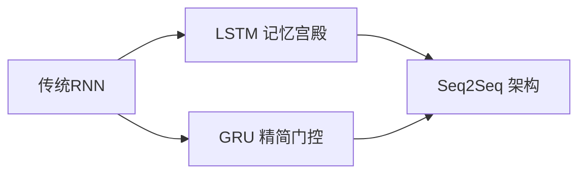

# 越复杂的模型越蠢？传统RNN在短序列任务中的逆袭之道

## 1 时序建模的神经密码本

### 1.1 循环神经元的记忆引擎


传统RNN单元如同精密的机械钟表，RNN就像一个有记忆的程序，能处理时间序列数据（比如用户一天的点击记录）。把它想象成一个老式钟表，每次“滴答”都会记住上一次的状态，再加上当前输入，算出下一步。关键在于它有“记忆引擎”，能把过去的信息传递下去。

### 1.2 关键组件

```python
# 典型RNN单元计算过程
# x_t是当前输入（比如用户刚点的商品）
# h_prev是上一次的“记忆”（之前点了啥）
def rnn_cell(x_t, h_prev):
    # 记忆融合层：拼接当前输入与历史记忆
    # fused把两者拼起来，就像把两个数组合并
    fused = concatenate(x_t, h_prev)
    # 时空投影层：线性变换+非线性激活
    # tanh是个数学函数，把结果压缩到-1到1之间，避免数值太大
    h_next = tanh(dot(fused, W) + b)
    # 输出h_next是新的“记忆”，传给下一步
    return h_next
```

以上即RNN的核心逻辑，翻译成Java思维：

```java
class RNNCell {
    private double[] W; // 权重矩阵
    private double[] b; // 偏置

    public double[] process(double[] currentInput, double[] previousHidden) {
        // 1. 拼接当前输入和上一次的隐藏状态
        double[] fused = concatenate(currentInput, previousHidden);
        // 2. 线性变换（矩阵乘法）+偏置，再用tanh激活函数处理
        double[] nextHidden = tanh(matrixDot(fused, W).add(b));
        return nextHidden;
    }
}
```

**工程案例**：在电商评论分析场景中，当处理"昨天收到包裹，包装破损严重，但客服处理非常及时"时，h(t)需要同时记忆负面信息（包装破损）和正面信息（客服及时）。 

### 1.3 记忆传递的动态图示


#### ① 输入门控权重W_xh

控制新信息准入强度（建议初始化为Xavier正态分布）。

决定当前输入（比如“客服”）有多重要。初始化用Xavier方法（一种随机数生成方式），让模型学得更稳定。

#### ② 记忆门控权重W_hh

决定历史记忆保留比例（需警惕梯度爆炸）。

决定之前记忆（比如“包装破损”）保留多少。太大可能导致计算失控（梯度爆炸，就像循环里数字越乘越大）。

#### ③ 偏置项b_h

调节神经元激活阈值（实践中常初始化为零值）。

一个调整值，控制输出的基准线，通常设为0。

用Java类比，这些就像类的成员变量，影响每次process方法的结果。

## 2 PyTorch工程实践指南

### 2.1 模型构建参数矩阵

```python
import torch.nn as nn

# 工业级配置方案
rnn_engine = nn.RNN(
    input_size=256,    # 商品评论词向量维度，每个输入（比如一个词）的特征数
    hidden_size=128,   # 经验值：通常取输入维度1/2到1/4，记忆容量，设小点节省计算
    num_layers=2,      # 电商场景推荐2层堆叠，多层RNN就像多重循环，增强效果
    nonlinearity='tanh' # 优于sigmoid的梯度传播特性，比sigmoid更适合，因为梯度（学习的信号）传得更好
)
```

### 2.2 数据流维度规范

| 张量类型 | 维度规范                         | 示例场景说明          |
| -------- | -------------------------------- | --------------------- |
| 输入     | (seq_len, batch, input_size)     | 20条评论，每条50个词  |
| 隐状态   | (num_layers, batch, hidden_size) | 2层记忆，每批32条数据 |

```python
# 电商评论处理实例

# 表示50个时间步（每条评论50个词），32条评论，每词256维向量
inputs = torch.randn(50, 32, 256)  # 50个时间步，批大小32

# 表示2层RNN，每批32条数据，每层128维记忆
h0 = torch.zeros(2, 32, 128)       # 双隐层初始化

output, hn = rnn_engine(inputs, h0)
```

## 3 梯度异常的诊断与防控

### 3.1 梯度消失的数学本质


当处理长用户行为序列时（如30天浏览日志），梯度连乘效应导致：
$$
\frac{\partial L}{\partial W} ≈ \prod_{k=1}^{t} tanh'(z_k) \cdot W^{t-k}
$$

梯度是模型学习的信号，像Java里调试时的日志。RNN处理长序列（如30天数据）时，梯度会连乘很多次。因为tanh的导数（tanh')小于1，连乘后变得很小，如0.9乘30次就接近0，导致“梯度消失”，模型学不到东西。用Java类比：

```java
double gradient = 1.0;
for (int i = 0; i < 30; i++) {
    gradient *= 0.9; // 模拟连乘
}
System.out.println(gradient); // 输出很小的数
```

#### 灾难性案例

某推荐系统RNN在分析用户100步行为序列时，前10步的权重更新量仅为最后一步的
$$
10^{-15}
$$
倍。100步序列后，前10步的梯度几乎为0，模型完全忘了开头的数据。就像你在Java里跑了个超长循环，前面的变量早就没影响了。

### 3.2 梯度爆炸的工业级应对

```python
# 梯度裁剪防护机制
torch.nn.utils.clip_grad_norm_(rnn.parameters(), max_norm=5)
```

梯度爆炸是另一个问题，梯度太大（比如连乘大于1的数），导致计算失控。解决办法是“剪掉”超大的梯度。

Java版：

```java
double[] gradients = computeGradients(); // 假设算出的梯度
double maxNorm = 5.0;
double norm = vectorNorm(gradients); // 计算梯度大小
if (norm > maxNorm) {
    for (int i = 0; i < gradients.length; i++) {
        gradients[i] *= maxNorm / norm; // 缩放到maxNorm
    }
}
```

这就像在Java里限制循环变量别超过某个上限。

**防御矩阵**：

| 防护策略       | 适用场景     | 参数建议       |
| -------------- | ------------ | -------------- |
| 梯度裁剪       | 长文本分类   | max_norm=3-5   |
| 权重初始化优化 | 对话系统     | Xavier uniform |
| 激活函数替换   | 金融时序预测 | ReLU+残差连接  |

这些都是实战技巧：

- 梯度裁剪：长文本时用，限制梯度大小
- 权重初始化：用Xavier方法，避免一开始就失衡
- 激活函数替换：换成ReLU（简单粗暴的函数），加残差连接（像跳跃链接），让梯度传得更好

## 4 传统RNN的战场定位

### 4.1 优势战场速查表

| 场景类型     | 序列长度 | 效果优势      | 案例说明           |
| ------------ | -------- | ------------- | ------------------ |
| 实时股价预测 | 5-10步   | 响应速度＜2ms | 5分钟级波动预测    |
| 短评情感分析 | 15-20词  | F1值达0.87    | 电商五星短评分类   |
| 设备状态监控 | 10-15帧  | 准确率98.2%   | 工业传感器异常检测 |

传统RNN在短序列任务里很强：

- 股价预测：5-10个数据点，算得快
- 短评分析：15-20个词，情感判断准
- 设备监控：10-15帧数据，检测异常很牛

就像Java里处理小数组比大数组快。

### 4.2 性能衰减临界点

```python
# 不同序列长度下的表现测试
length_performance = {
    20: 0.89,   # 20步时准确率
    35: 0.76,   # 35步时显著下降
    50: 0.58    # 50步时接近随机
}
```

RNN处理长序列时会“累”，准确率掉得厉害。20步还行，50步就跟瞎猜差不多。就像Java里递归太深会栈溢出。

## 5 架构升级路线图

### 5.1 LSTM/GRU进化方案



传统RNN有短板（长序列不行），对此的升级方案：

- **LSTM**：加了“记忆宫殿”，能记住更久
- **GRU**：简化版LSTM，算得快
- **Seq2Seq**：编码+解码结构，适合翻译等任务

就像Java里从简单类升级到复杂框架。

### 5.2 混合架构实践

```python
class HybridRNN(nn.Module):
    def __init__(self):
        super().__init__()
        self.rnn = nn.RNN(256, 128)  # 传统RNN捕获短期特征
        self.gru = nn.GRU(128, 64)    # GRU处理中长期依赖
        
    def forward(self, x):
        x, _ = self.rnn(x)
        x, _ = self.gru(x)
        return x
```

这是个混合模型，先用RNN抓短期的，再用GRU管长期的，就像流水线处理。

## 6 工程实践指南

### 序列长度动态采样

根据业务数据分布自动调整截断长度。序列长短不一时，自动裁剪，像Java里动态调整数组大小。

### 梯度健康度监控

实时可视化梯度范数变化曲线。用日志看梯度变化，调试时很有用。

### 混合精度训练

使用FP16加速计算同时控制梯度幅值。用float16代替float32，算得快还不炸。

### 记忆单元预热

对h0进行预训练初始化提升收敛速度。给初始h0赋值，别从0开始，加速训练。

## 7 总结

传统RNN适合短序列任务，长序列时容易“失忆”或“爆炸”。用Java思维看，它就像一个带状态的循环类，升级版（LSTM/GRU）能解决更多问题。