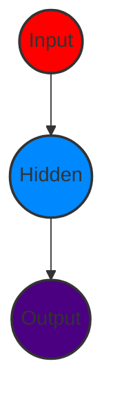

# 突破序列建模瓶颈：解密RNN为何成为NLP任务的核心引擎

## 1 啥是RNN模型？

RNN（Recurrent Neural Network，循环神经网络），以序列数据为输入，通过网络内部的结构设计有效捕捉序列之间的关系特征，一般也以序列形式进行输出。一种专门处理“序列数据”的模型。

### 什么是序列数据？

想象你在Java里处理一个`List<String>`，里面存的是["What", "time", "is", "it"]，这是一个有顺序的单词列表。RNN就是为这种有前后关系的输入而设计。

普通神经网络（如单层感知机）就像一个简单的方法：输入一个值，输出一个结果，无记忆。
一般单层神经网络结构：




而RNN厉害在它内部有个“循环”，能记住之前处理过的信息，就像在方法里加了个static变量，记录上次循环的结果，影响下次计算。

输出通常也是序列，如输入一句话，输出翻译后的另一句话。

RNN单层网络结构：


RNN和普通神经网络的区别在于，它多了“循环”。假设还是处理["What", "time", "is", "it"]，RNN会一个词一个词地读，但每次读的时候，不仅看当前词，还会参考上一次的“状态”。

用Java类比：

```java
class RNN {
    private double previousHiddenState = 0; // 上一次的隐藏状态
    public double processWord(String word, double currentInput) {
        double hiddenState = currentInput * weight1 + previousHiddenState * weight2 + bias;
        previousHiddenState = hiddenState; // 更新状态
        return hiddenState * weight3 + bias2; // 输出
    }
}
```

这里的previousHiddenState就是RNN的“记忆”，让它能捕捉序列的关系。

------

以时间步对RNN进行展开后的单层网络结构：


“时间步展开”，就是把RNN的循环按时间顺序摊开看。假设输入是4个词，RNN会分成4个步骤：

- 时间步1：处理"What"，生成隐藏状态h1
- 时间步2：处理"time"，用h1和"time"一起算出h2
- 时间步3：处理"is"，用h2和"is"算出h3
- 时间步4：处理"it"，用h3和"it"算出h4。

就像循环调用上面的processWord方法4次，每次都带着上一次的结果。

------

RNN的循环机制使模型隐层上一时间步产生的结果，能作为当下时间步输入的一部分（当下时间步的输入除了正常的输入外还包括上一步的隐层输出），对当下时间步的输出产生影响。

这就是RNN的核心：它有“记忆力”。用Java思维看，每次循环时，输入不只是当前的数据（比如"time"），还有上一次的hiddenState。这就像你在写一个方法时，不仅用当前参数，还会参考一个全局变量的历史值。如：

```java
double hidden = processInput(currentWord) + processPreviousState(previousHidden);
```

这样，RNN就能理解序列的上下文，如"What time"连起来比单独的"time"更有意义。

## 2 RNN模型的作用

RNN结构能很好利用序列之间关系，因此针对自然界具有连续性的输入序列，如人类语言、语音等进行很好处理，广泛应用于NLP领域各项任务。因其擅长处理“连续性”数据。生活中，语言、语音、时间序列（比如股票价格）都是连续的，RNN能抓住这种前后依赖关系。编程世界，假设你写了个聊天机器人，RNN可用来：

- 文本分类：判断用户输入是正面还是负面评价
- 情感分析：分析用户是不是生气了
- 意图识别：搞清楚用户想问时间还是天气
- 机器翻译：把中文翻译成英文

这些任务都依赖序列的顺序，RNN正好能胜任。以一个用户意图识别的例子进行简单分析：

## 3 用户意图识别


### step1：用户输入

比如用户输入了"What time is it ?"，先要对它进行基本的分词，因RNN是按序工作，每次只接收一个单词进行处理：


假设你在Java里收到用户输入：

```java
String input = "What time is it ?";
String[] words = input.split(" "); // 分词成 ["What", "time", "is", "it", "?"]
```

RNN会按顺序处理每个单词，就像for循环一样：

```java
for (String word : words) {
    rnn.processWord(word);
}
```

### step2：先处理"What"

先将单词"What"输给RNN，它将产生一个输出O1


### step3：再处理"time"

继续将单词"time"输给RNN，但此时RNN不仅利用"time"产生输出O2，还会用来自上一层隐层输出O1作为输入信息：


### step4：重复以上步骤

重复直到处理完所有单词：


### step5 隐层输出

最后，将最终的隐层输出O5进行处理来解析用户意图：


用Java模拟这个过程：

```java
class IntentRNN {
    private double previousHidden = 0;
    public double processWord(String word) {
        double currentInput = wordToNumber(word); // 假设把单词转成数字
        double hidden = currentInput * 0.5 + previousHidden * 0.3; // 简化的计算
        previousHidden = hidden;
        return hidden * 0.7; // 输出
    }
    
    public String getIntent(double finalHidden) {
        return finalHidden > 0 ? "Asking for time" : "Unknown"; // 简化判断
    }
}

IntentRNN rnn = new IntentRNN();
for (String word : new String[]{"What", "time", "is", "it", "?"}) {
    double output = rnn.processWord(word);
}
String intent = rnn.getIntent(rnn.previousHidden);
```

- "What"生成O1，记下隐藏状态h1
- "time"用h1帮忙生成O2，记下h2
- 最后处理完"?"，用最终的h5判断意图是“问时间”

## 4 RNN模型分类

两个角度对RNN模型分类：

### 4.1 输入和输出的结构

#### ① N vs N - RNN

RNN最基础的结构形式，输入、输出序列等长。由于这限制，使其适用范围较小，可用于生成等长度的合辙诗句。

```bash
                y₁      y₂      		y₃      	  y₄
                ↑       ↑       		↑       	  ↑
                │       │       		│       		│
┌───┴───┐ ┌───┴───┐ ┌───┴───┐ ┌───┴───┐ ┌───┴───┐
│   h0   │→│   h₁  │→│   h₂  │→│   h₃  │→│   h₄  │
└───┬───┘ └───┬───┘ └───┬───┘ └───┬───┘ └───┬───┘
                ↑         ↑          ↑         ↑
                │         │          │         │
                x₁        x₂         x₃        x₄
```

#### ② N vs 1 - RNN

- 输入是一个序列
- 输出是一个单独的值而非序列

在最后一个隐层输出h上进行线性变换即可实现。为了更好的明确结果，一般还要用sigmoid或softmax处理，常被应用在文本分类。
$$
Y = \text{Softmax}(Vh_4 + c)
$$

```bash
																												 (Y)
                                                          ^
                                                          |
(h0) --> [+--h1--+] --> [+--h2--+] --> [+--h3--+] --> [+--h4--+] 
          ^               ^               ^               ^
          |               |               |               |
         x1              x2              x3              x4
```

输入一串，但输出一个。如输入["What", "time", "is", "it"]，输出一个意图“Asking for time”。Java里就像：

```java
List<String> input = Arrays.asList("What", "time", "is", "it");
double finalHidden = 0;
for (String word : input) {
    finalHidden = rnn.processWord(word);
}
String result = softmax(finalHidden); // 假设用softmax判断意图
```

常见于文本分类，如判断评论是好评or差评。

#### ③ 1 vs N - RNN

若输入不是序列，而输出为序列。

最常采用的一种方式就是使该输入作用于每次的输出之上，这种结构可用于将图片生成文字任务等。

```bash
      y1   		y2   		y3   		y4
      ^    		^    		^    		^
      |    		|    		|    		|
(h0)-->[h1]-->[h2]-->[h3]-->[h4]
       ^    	^    		^    	  ^
       |    	|    		|    		|
           \   		/ 	/ 	/
           \ 	/ 		/ 	/ 
                 X
```

“1 vs N”是输入一个东西，输出一串。如输入一张图片，输出描述文字["The", "cat", "is", "cute"]。Java里

```java
String image = "cat.jpg";
List<String> caption = rnn.generateCaption(image);
```

每次输出一个词，但都参考同一个输入（图片）。

#### ④  N vs M - RNN

不限输入、输出长度，由编码器和解码器两部分组成，二者内部结构都是某类RNN，也称seq2seq架构。

输入数据首先通过编码器，最终输出一个隐含变量c，之后最常用的做法是使用这个隐含变量c作用在解码器进行解码的每一步上，以保证输入信息被有效利用。

```bash
                       y1  		y2  	y3
                        ^   	^   	^
                        |   	|   	|
        			 (h0')->[h1']->[h2']->[h3']
                          ^   ^   ^
                           \  |  /
                            \ | /
                              C
                              ^
                              |
(h0)-->[h1]-->[h2]-->[h3]-->[h4]
        ^   		^   		^   	^
        |   		|   		|   	|
        x1  		x2  		x3  	x4
```

“N vs M”是输入和输出长度可以随便变，如机器翻译：输入["What", "time"]，输出["现在", "几点", "了"]。分成两部分：

- 编码器：把输入压成一个“总结”（隐变量c）。
- 解码器：用这个总结生成输出。

Java里就像：

```java
List<String> input = Arrays.asList("What", "time");
double context = encoder.encode(input); // 编码
List<String> output = decoder.decode(context); // 解码
```

### 4.2 “升级版”RNN

解决传统RNN的一些问题（如记不住太长的序列）。

- **传统RNN**：最基础的，像上面的例子。
- **LSTM**：加了“记忆单元”，能记住更久的信息。
- **Bi-LSTM**：双向的，能同时看前后文。
- **GRU**：LSTM的简化版，计算更快。
- **Bi-GRU**：双向GRU。

就像Java里优化算法，从简单循环升级到用HashMap存历史数据。

seq2seq架构最早被提出应用于机器翻译，因其输入输出不受限制，如今也是应用最广的RNN模型结构。