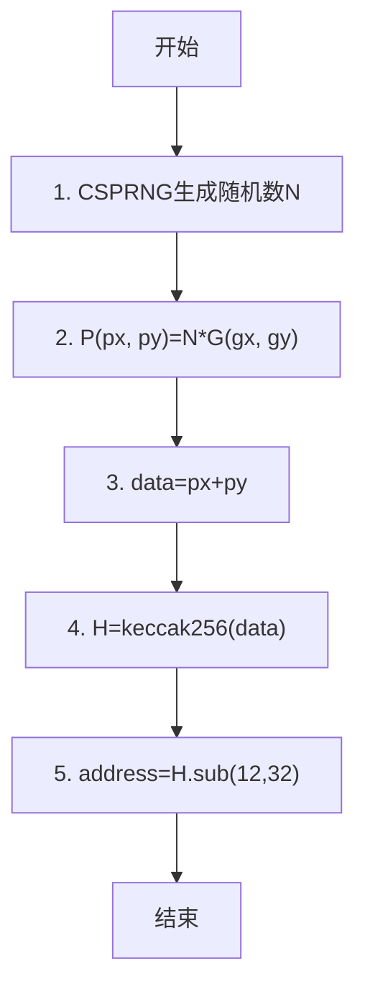

# 01-以太坊智能合约与高级语言

## 1 啥是以太坊？

- 以太坊是一个任何人都可以创建和运行去中心化应用的区块链平台
- 没有任何人可控制或拥有以太坊，它是由很多世界各地的人建立的开放源码项目
- 以太坊作为和比特币对标的项目，其设计更具有适应性和灵活性，易创建应用在以太坊上运行
- 以太坊和许多平台一样，可用Solidity或其他语言进行开发
- 以太坊开发完成后，可直接部署在以太坊平台，无任何限制
- 其他人要使用这些开发的应用也不需要下载，只需要调用开发者提供的接口或开发者建立在接口上的服务即可
- 若开发者要使用别人开发的以太坊应用，也可看到其他人源码
- 以太坊像比特币一样，也提供自己的token------以太币，可进行收款、付款、转账等各种交易

## 2 以太坊账户

以太坊的账户模型和比特币非常相似，如都有椭圆曲线算法，并以secp256k1作为参数。

但以太坊的账户模型也针对性做了一些修改以适应以太坊的需求。如以太坊的账户分为外部账户和合约账户。

### 2.1 外部账户（Externally Owned Accounts，EOAs）

以太坊的外部账户和比特币的账户模型一样：

- 私钥是使用CSPRNG生成的数字
- 地址是通过公钥计算获取到的

不过以太坊计算地址的方式和比特币有所不同。看以太坊地址计算流程。

- 首先，使用密码学安全伪随机数生成器生成一个数字N作为私钥
- 然后，通过椭圆曲线乘法计算获取公钥P（px，py）
- 其中G是生成点，在椭圆曲线参数secp256k1中被定义
- 然后，拼接公钥P的横坐标和纵坐标得到中间值data，计算data的keccak256哈希值得到256位32字节值H
- 取H的最后20个字节就是以太坊外部账户的地址
- 和比特币的地址计算流程相比，以太坊的地址计算太“友好”，没有前缀和后缀，也没校验码，直接拼接公钥计算keccak256哈希，截取最后20字节就完成地址的计算

#### 外部账户的特性和可执行操作

- 有一个以太币余额属性，表示账户余额
- 可发送交易(以太币发送或者接受，触发合约代码)
- 被一个私钥控制
- 没有关联的合约代码

### 2.2 合约账户

和比特币不同的是，以太坊还有一种合约账户的账户类型，因为与比特币纯粹的数字货币不同，以太坊支持智能合约。

智能合约可看做一个特殊的账户，在以太坊中称合约账户，其特殊在于关联了可执行的智能合约代码。

合约地址是在合约创建过程中生成的，一般根据合约数据计算得到，也可通过创建外部地址的方式得到。

#### 合约账户拥有的属性和可执行的操作

- 有一个以太币余额属性，表示账户余额
- 关联有合约代码
- 合约可以被交易触发执行或者接收到其他合约消息执行
- 可以执行任意复杂的操作，操作它的永久存储区，调用其他合约等

### 2.3 外部账户 V.S 合约账户

基本一样，以太坊虽区分两种账户，但数据结构上一致，只在具体实现有所差异。

有相同的属性：

- none
- balance
- storageRoot
- codeHash

## 3 以太坊交易

### 3.1 gas、gasPrice与gasLimit

以太坊中细化了交易费相关，交易肯定有交易费用，以太坊中引入一个中间概念 gas，字面意“汽油”，可理解为一种燃料或能量，在以太坊交易涉及的各种操作都要 gas。如存储一个数据、创建一个合约、执行一次 Hash计算都需要。

一个交易使用的能量 gas 可作为衡量一个交易的计算量，需要越多的计算和存储就花费更多gas。当然仅有 gas 不够，还需要为 gas 定价，就像汽油有价格，gas 也有价格，即gasPrice。

gasLimit，表示限制最多使用的 gas，主要考虑到遇到错误时做尽量减小损失。如本来一个正常的合约调用只需很少gas，但因错误造成死循环。若无 gasLimit 就会一直运行，不断消耗 gas，而 gas 要花钱。

### 3.2 gasUsed与交易花费

以太坊对操作需要的gas做了些规定，如交易的基本费用是500gas、合约创建是53000 gas、交易数据每一个字节需要 5 gas 等。

正因每个操作都有明确的需要多少gas，所以我们可对交易或合约调用需要的gas进行评估。

gasUsed就是执行所有操作需要的gas总和。交易的花费就是一个交易需要使用多少以太币，假设交易花费为totalCost，则 totalCost = gasUsed * gasPrice

### 3.3 交易（transaction）

以太坊的交易指区块链上的外部账户向另一外部账户发送存储消息的签名数据包。可简单看做以太坊的一个账户向另一个账户转账。

#### 以太坊交易中包含的属性

- gasLimit表示这笔交易最多允许使用的 gas 的数量
- gasPrice指定这笔交易gas的价格，一般的钱包会给一个均值作为默认值，gasPrice会直接影响到交易完成的时间，所以别设置太低
- nonce是随机数，但影响交易执行，若交易的 nonce
  - ＜ 发起交易账户的 nonce 属性，会被直接丢弃
  - ＞ 发起交易账户的 nonce，就会排队等待
  - 直到账户nonce属性达到交易设置的nonce时，才可能被执行，可利用交易的 nonce 属性来覆盖之前的交易

下图展示与交易相关的不同属性和它们之间的关系：

- from，交易发起方的地址
- to，交易接收方的地址
- value，from要发送给to的以数据签名主要用来证明交易的合法性，检查是否是from地址对应私钥签名的数据以太币的金额

数据签名，用来证明交易的合法性，检查是否是from地址对应签名的数据以判断是否接受交易。

| 转账         | data是可选数据               |
| ------------ | ---------------------------- |
| 合约创建     | data是编译之后的合约字节码   |
| 合约方法调用 | data是合约方法签名和参数编码 |

消息（message），本质是个transaction，不过消息由合约产生，适当合约执行call或delegatecall时产生而不是由外部产生。

## 4 以太坊网络

以太坊是一个分布式系统，使用了分布式哈希表拓扑结构。每个节点都按距离维护一张路由表，路由表维护256个bucket，每个桶存放k个Node（k=16，指定距离范围最多能存放16个节点，此举可以增加整个网络的稳定性），每个Node用NODEID作为唯一标识符。

### 4.1 以太坊与Kademlia

Kademlia，一种点对点分布式哈希表（DHT），它在易出错的环境中也具备可证实的一致性和性能。

Kademlia使用一种基于异或指标的拓扑结构来路由查询和定位节点，这简化了算法并有助于证明。该拓扑结构有个特点：每次消息交换都能传递或强化有效信息。系统利用这些信息进行并发的异步查询，可容忍节点故障，并且故障不会导致用户超时。

以太坊的节点发现机制基于Kademlia，但其目的却不同：

- Kademlia旨在成为在分布式对等网络中存储和查找内容的手段
- 以太坊仅用于发现新的节点

### 4.2 通过一个NodelD找到对应节点信息

- 先从路由表中找到距离目标节点T最近的N个节点
- 然后向这N个节点发超询请求
- 这N个节点会返回自身路由表中距离目标节点T最近的N个节点信息
- 通过选代这个过程，就有可能查找到NodeID为指定值的节点信息

### 4.3 以太坊客户端

| 客户端         | 语言       | 代码库                                        |
| -------------- | ---------- | --------------------------------------------- |
| Go-ethereum    | Go         | https://github.com/ethereum/go-ethereum       |
| Parity         | Rust       | https://github.com/paritytech/parity-ethereum |
| Cpp-ethereum   | C++        | https://github.com/ethereum/aleth             |
| pyethapp       | Python     | https://github.com/ethereum/pyethapp          |
| Ethereumjs-lib | JavaScript | https://github.com/ethereumjs/ethereumjs-lib  |
| Ethereum(J)    | Java       | https://github.com/ethereum/ethereumj         |

Go-ethereum是使用最多的客户端，也被称为Geth，是由以太坊基金会使用Go语言所开发的。

## 5 以太坊网络

### 区块头包含的属性

- 以太坊区块头中包含的属性都是和区块与交易相关的
- ParentHash 是父区块的Hash 值，是为了组成链式结构
- UncleHash是叔块Hash值，叔块是为了保证以太坊区块链安全而引人的
- Coinbase是挖出区块的矿工地址，也就是获得挖出区块奖励的地址
- Root 是和账户相关的根 Hash值.TxHash是和交易相关的根Hash值
- ReceiptHash 是和交易收据相关的根 Hash 值

因为账户、交易和交易收据的内容比较多，在区块头中只包含它们的 Hash 值，但这些Hash值是一个根Hash值，是通过内容计算获取的，只要有交易、账户或者交易数据被修改，相应的Hash值也会修改，所以可以放在区块头中作为工作量证明机制的参数

## 6 Hardhat和以太坊

1. **以太坊（Ethereum）**：
   - **区块链网络**：以太坊是一个开源的区块链平台，它允许开发者构建和运行去中心化的应用程序（DApps）。
   - **智能合约**：以太坊的核心特色是智能合约，它是一种自动执行、管理或执行合同条款的计算机协议。
   - **加密货币**：以太坊有自己的加密货币，称为以太（ETH），用于支付交易费用和计算服务。
   - **共识机制**：以太坊使用工作量证明（PoW）机制，但正在向权益证明（PoS）机制转变（称为以太坊2.0）。
2. **Hardhat**：
   - **开发框架**：Hardhat是一个以太坊开发环境，它允许开发者本地编译、测试和部署智能合约。
   - **工具集**：Hardhat提供了一套完整的工具和插件，用于简化智能合约的开发流程。
   - **本地网络**：Hardhat内置一个本地以太坊网络节点，开发者可在本地环境部署和测试智能合约，而无需连接到主网或测试网
   - **脚本和任务**：Hardhat允许开发者编写脚本和定义自定义任务，以便自动化开发流程中的重复性工作

综上，以太坊是一个全球性的区块链平台，而Hardhat是一个为以太坊智能合约开发提供便利的工具。开发者使用Hardhat来编写、测试和部署将以太坊作为运行平台的智能合约。简而言之，Hardhat是为了方便开发者在以太坊上构建应用而设计的开发工具。

参考：

- https://hardhat.org/hardhat-runner/docs/getting-started#installation