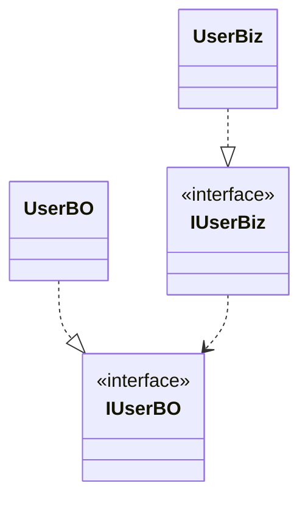
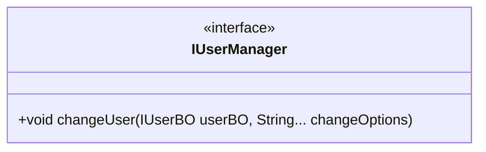
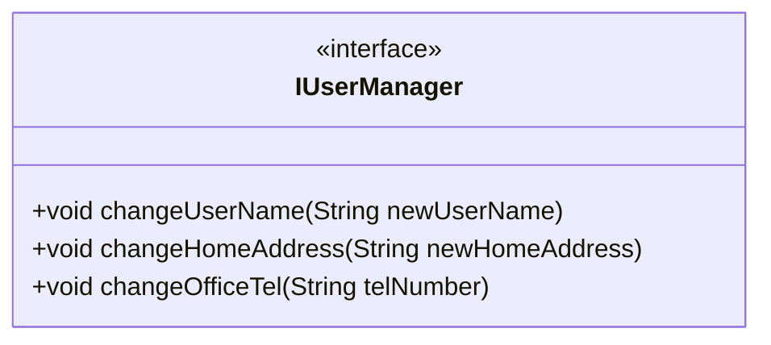

# 软件设计原则(01)-单一职责原则（Single Responsibility Principle，SRP）

## 1 简介

### 1.1 定义

不要存在多于一个导致类变更的原因。

### 1.2 特点

一个类/接口/方法只负责一项职责。

### 1.3 优点

- 降低类的复杂度、提高类的可读性，提高系统的可维护性、降低变更引起的风险。

- 类的复杂性降低，实现什么职责都有清晰明确定义
- 可读性提高，复杂性降低，那当然可读性提高
- 可维护性提高，可读性提高，更易维护
- 变更引起的风险降低，变更必不可少。若接口的单一职责做好，一个接口修改只对相应的实现类有影响，对其他接口无影响。对系统扩展性、维护性都有大帮助

名字容易让大部分人理解成：一个类只干一件事，似乎很合理呀！所有程序员都知道“高内聚、低耦合”的口号，把相关代码放一起。

若随便拿个模块去问作者，这个模块是不是只做一件事，异口同声：对，只做了一件事。看来原则很通用啊，都懂，为啥还要有这样一个设计原则？

因为一开始的理解就是错的！错在把单一职责理解成有关如何组合的原则，实际关于如何分解的。

Robert Martin对单一职责的定义的变化：

- 《敏捷软件开发：原则、实践与模式》
  一个模块应该有且仅有一个变化的原因
- 《架构整洁之道》
  一个模块应该对一类且仅对一类行为者（actor）负责

- 单一职责原则 V.S 一个类只干一件事
  最大的差别就是，将变化纳入考量。

分析第一个定义：一个模块应该有且仅有一个变化的原因。
软件设计关注长期变化，拥抱变化，我们最不愿意面对却不得不面对，只因变化会产生不确定性，可能：

- 新业务的稳定问题
- 旧业务遭到损害而带来的问题

所以，一个模块最理想的状态是不改变，其次是少改变，它可成为一个模块设计好坏的衡量标准。

但实际开发中，一个模块频繁变化，在于能诱导它改变的原因太多！

## 2 案例

### 2.1 一群鸟！

最初的Bird类：

```java
package com.javaedge.design.principle.singleresp.bird;

/**
 * @author JavaEdge
 */
public class Bird {

    public void mainMoveMode(String birdName) {
        System.out.println(birdName + "用翅膀飞");
    }
}
```

简单测试类：

```java
package com.javaedge.design.principle.singleresp.bird;

/**
 * @author JavaEdge
 */
public class Test {
    public static void main(String[] args) {
        Bird bird = new Bird();
        bird.mainMoveMode("大雁");
        bird.mainMoveMode("鸵鸟");
    }
}
```

显然鸵鸟还用翅膀飞是错误的！于是，修改类实现：

```java
package com.javaedge.design.principle.singleresp.bird;

/**
 * @author JavaEdge
 */
public class Bird {

    public void mainMoveMode(String birdName) {
        if ("鸵鸟".equals(birdName)) {
            System.out.println(birdName + "用脚走");
        } else {
            System.out.println(birdName + "用翅膀飞");
        }
    }
}

```

这种设计依旧很low，总不能一味堆砌 if/else 添加鸟类！

结合该业务逻辑，考虑分别实现类职责，即根据单一原则创建两种鸟类即可：

```java
package com.javaedge.design.principle.singleresp.bird;

/**
 * 飞鸟
 *
 * @author JavaEdge
 */
public class FlyBird {

    public void mainMoveMode(String birdName) {
        System.out.println(birdName + "用翅膀飞");
    }
}
```

```java
package com.javaedge.design.principle.singleresp.bird;

/**
 * 走鸟
 *
 * @author JavaEdge
 */
public class WalkBird {

    public void mainMoveMode(String birdName) {
        System.out.println(birdName + "用脚走");
    }
}
```

```java
package com.javaedge.design.principle.singleresp.bird;

/**
 * @author JavaEdge
 */
public class Test {
    public static void main(String[] args) {
        FlyBird flyBird = new FlyBird();
        flyBird.mainMoveMode("大雁");

        WalkBird walkBird = new WalkBird();
        walkBird.mainMoveMode("鸵鸟");
    }
}
```


### 2.2 课程案例

最初的课程接口有两个职责，耦合过大：

```java
package com.javaedge.design.principle.singleresp.course;

/**
 * @author JavaEdge
 */
public interface ICourse {
    
    // 一类职责
    /**
     * 获取课程名
     *
     * @return 课程名
     */
    String getCourseName();

    /**
     * 获取课程视频
     *
     * @return 课程视频
     */
    byte[] getCourseVideo();

    // 二类职责
    /**
     * 学习课程
     */
    void studyCourse();

    /**
     * 退出课程
     */
    void refundCourse();

}
```


按职责拆分：

````java
package com.javaedge.design.principle.singleresp.course;

/**
 * @author JavaEdge
 */
public interface ICourseContent {

    /**
     * 获取课程名
     *
     * @return 课程名
     */
    String getCourseName();

    /**
     * 获取课程视频
     *
     * @return 课程视频
     */
    byte[] getCourseVideo();
}

````

```java
package com.javaedge.design.principle.singleresp.course;

/**
 * @author JavaEdge
 */
public interface ICourseManager {

    /**
     * 学习课程
     */
    void studyCourse();

    /**
     * 退出课程
     */
    void refundCourse();
}
```

### 2.3 用户管理

用户、机构、角色管理模块基本都是RBAC模型（Role-Based Access Control，基于角色的访问控制，通过分配和取消角色来完成用户权限的授予和取消，使动作主体（用户）与资源的行为（权限）分离）。

对于用户管理、修改用户的信息、增加机构（一个人属于多个机构）、增加角色等，用户有这么多的信息和行为要维护，我们就把这些写到一个接口中，都是用户管理类：


用户信息维护类图：


#### 问题

用户属性和用户行为严重耦合！这个接口确实设计得一团糟，应当：

- 用户信息抽取成一个BO（Business Object，业务对象）

- 用户行为抽取成一个Biz（Business Logic，业务逻辑）


职责划分后的类图：


重新拆分成两个接口：

- IUserBO，负责用户的属性，职责就是收集和反馈用户的属性信息
- IUserBiz，负责用户的行为，完成用户信息的维护和变更


面向接口编程，所以产生UserInfo对象后，可将其当IUserBO接口使用，也可当IUserBiz接口使用，取决于使用场景：

- 获得用户信息，就当IUserBO的实现类
- 维护用户的信息，就当IUserBiz的实现类

```java
IUserInfo userInfo = new UserInfo();
// 我要赋值，就认为它是一个纯粹的BO
IUserBO userBO = (IUserBO)userInfo;
userBO.setPassword("abc");

// 我要执行动作，就认为是一个业务逻辑类
IUserBiz userBiz = (IUserBiz)userInfo;
userBiz.deleteUser();
```

拆分后，问题就解决了

#### 为何要将一个接口拆分成两个？

实际使用中，更倾向使用两个不同的类或接口：

- IUserBO
- IUserBiz

项目中常用的SRP类图：



以上我们把一个接口拆分成两个接口的动作，就是依赖SRP，单一职责原则的定义：应有且仅有一个原因，引起类的变更。

### 2.4 电话通话

通话有4个过程：拨号、通话、回应、挂机。

#### 原始接口

```java
package com.javaedge.design.principle.singleresp.phone;

/**
 * @author JavaEdge
 * @date 2021/7/5
 */
public interface IPhone {

    /**
     * 拨通电话
     * @param phoneNumber 手机号
     */
    void dial(String phoneNumber);

    /**
     * 通话
     * @param o 对象
     */
    void chat(Object o);

    /**
     * 通话完毕，挂电话
     */
    void hangup();
}
```

该接口接近完美，SRP要求一个接口或类只有一个原因引起变化，即一个接口或类只有一个职责，它就负责一件事情。看上面接口：

- 只负责一件事？
- 只有一个原因引起变化？

好像都不是！IPhone包含俩职责：

- 协议管理：dial()、hangup()实现的是协议管理，分别负责拨号接通和挂机
- 数据传送：chat()实现数据的传送，把说的话转换成模拟信号或数字信号传递到对方，再把对方传递过来的信号还原成语言

协议管理的变化会引起这个接口或实现类的变化吗？会！
那数据传送（电话不仅可以通话，还可上网！）的变化会引起这个接口或实现类的变化吗？会！

这里有两个原因都引起了类变化。这两个职责会相互影响吗？

- 电话拨号，我只要能接通就成，不管是电信的还是联通的协议
- 电话连接后还关心传递的是什么数据吗？

分析发现类图上的IPhone接口包含两个职责，这两个职责的变化不相互影响，考虑拆分成两个接口。

#### 职责分明的电话类图


完全满足SRP，每个接口职责分明，结构清晰，但肯定不会采用。一个 Phone类要把ConnectionManager、DataTransfer组合才能使用。组合是一种强耦合关系，共同生命周期，这样强耦合不如使用接口实现，而且还多了俩类。

#### 再修改类图

简洁清晰、职责分明的电话类图：


一个类实现了两个接口，把两个职责融合在一个类中。
你可能说Phone有两个原因引起变化呀！是，但别忘我们是面向接口编程，我们对外公布的是接口而非实现类。而且，若真要实现类的SRP，还必须使用组合模式，这会引起类间耦合过重、类的数量增加等问题，人为增加设计复杂性。

#### SRP最难划分：职责

一个职责一个接口，但“职责”无法量化，一个类到底要负责哪些职责？这些职责该怎么细化？细化后是否都要有一个接口或类？

从实际项目考虑，功能上，定义一个IPhone接口也没错，实现了电话功能，而且设计简单，仅仅一个接口一个实现类。项目要考虑可变因素、不可变因素及相关的收益成本比率，因此设计一个IPhone接口也可能没错。

但若纯从“学究”理论上分析就有问题，有两个可变的原因放到了一个接口，就为以后变化带来风险。若以后模拟电话升级到数字电话，我们提供的接口IPhone是不是要修改了？接口修改对其他的Invoker类是不是有很大影响？

SRP提出编写程序的标准，用“职责”或“变化原因”来衡量接口或类设计得是否优良，但“职责”和“变化原因”都不可度量，因项目、环境而异。

### 2.5 项目管理工具

设计如下用户类，有用户信息管理、项目管理：

```java
class User {

    // 修改密码
    void changePassword (String password);

    // 加入一个项目
    void joinProject (Project project);

    // 接管一个项目,成为管理员
    void takeOverProject (Project project);

}
```

新需求：每个用户都能设置电话号码，于是新增方法

```java
class User {

    void changePassword(String password);

    void joinProject(Project project);

    void takeOverProject(Project project);

    // 设置电话号码
    void changePhoneNumber(PhoneNumber phoneNumber);

}
```

又来新需求：查看一个用户加入了多少个项目

```java
class User {

    void changePassword(String password);

    void joinProject(Project project);

    void takeOverProject(Project project);

    void changePhoneNumber(PhoneNumber phoneNumber);

    // 用户加入了多少项目
    int countProject();

}
```

几乎每个和用户沾边的需求，你都改user类，导致：

- User类一直膨胀
- 内部实现越来越复杂

这个类变动的频繁程度显然不理想，因为诱导变动的需求太多：

- 为啥要增加电话号码？用户管理的需求。用户管理的需求还会有很多，比如，用户实名认证、用户组织归属等
- 为啥要查看用户加入多少项目？项目管理的需求。项目管理的需求还会有很多，比如，团队管理、项目权限等。

两种完全不同的需求，但你都改同一个类，所以，User类无法稳定。最好拆分不同需求引起的变动。用户管理、项目管理两种不同需求，User拆成两个类：

- 用户管理类需求放到User
- 项目管理类的需求放到Member

```java
// 用户类
class User {

    // 修改密码
    void changePassword(String password);

}

// 项目成员类
class Member {

    // 加入一个项目
    void joinProject(Project project);

    // 接管一个项目,成为管理员
    void takeOverProject(Project project);

}
```

如此二者各自变动的理由就少了：

- 用户管理的需求只需调整User类
- 项目管理的需求只需调整Member类

### 变化来源

上面做法类似分离关注点。

要更好理解SRP，关键就是分离不同关注点。该案例分离的是不同的业务关注点。所以，理解SRP奥义在于理解分离关注点。

分离关注点，发现的关注点越多越好，粒度越小越好。你能看到的关注点越多，就能构建更多类，但每个类的规模相应越小，与之相关需求变动也越少，能稳定几率越大。

代码库里稳定的类越多越好。

> 将这种思路推演到极致，那一个类就应该只有一个方法，这样，它受到影响最小。

的确如此，但实际项目，一个类通常都不只一个方法，要求所有人都做到极致，不现实。

### 那应将哪些内容组织一起？

这就需要考虑SRP定义的升级版，即第二个定义：一个模块应该对一类且仅对一类行为者负责。若第一个定义将变化纳入考量，则升级版定义则将变化的来源纳入考量。

### 需求为什么会改变？

因为有各种人提需求，不同人提的需求关注点不同。
关心用户管理和关心项目管理的可能是两种不同角色的人。两件不同的事，到了代码，却混在一起，这显然不合理。
所以，分开才是一个好选择：

- 用户管理的人，我和他们聊User
- 项目管理的人，讨论Member

> 康威定律：一个组织设计出的系统，其结构受限于其组织的沟通结构。

Robert Martin说，SRP是基于康威定律的推论：一个软件系统的最佳结构高度依赖使用这个软件的组织的内部结构。
若软件结构不能够与组织结构对应，就会带来一系列麻烦。实际上，当我们更新对SRP的理解，你会发现，它的应用范围不仅可放在类这个级别，也可放到更大级别。

某交易平台有个关键模型：手续费率，交易一次按xx比例收佣金。平台可以利用手续费率做不同的活动，比如，给一些人比较低的手续费率，鼓励他们来交易，不同的手续费率意味着对不同交易行为的鼓励。

- 对运营人员
  手续费率是一个可以玩出花的东西
- 对交易系统而言
  稳定高效是重点。显然，经常修改的手续费率和稳定的系统之间存在矛盾。

这是两类不同行为者。所以，设计时，把手续费率设置放到运营子系统，而交易子系统只负责读取手续费率：

- 当运营子系统修改手续费率，会把最新结果更新到交易子系统
- 至于各种手续费率设置的花样，交易子系统根本无需关心

SRP还能指导我们在不同的子系统之间进行职责分配。所以，单一职责原则这个看起来最简单的原则，实际上也蕴含着很多值得挖掘的内容。
要想理解好单一职责原则：

- 理解封装，把什么样的内容放到一起
- 理解分离关注点，把不同的内容拆分开来
- 理解变化的来源，把不同行为者负责的代码放到不同地方


就可更好理解函数要小，每个函数承担的职责要单一，才能稳定。

## 4 单一且快乐

对于：

- 接口，设计时一定要单一
- 但对于实现类就需要多方面考虑

生搬硬套单一职责原则会引起类的剧增，给维护带来非常多的麻烦，而且过分细分类的职责也会人为地增加系统的复杂性。本来一个类可以实现的行为硬要拆成两个类，然后再使用聚合或组合的方式耦合在一起，人为制造了系统的复杂性。所以原则是死的，人是活的。

### 单一职责原则很难体现在项目

国内的技术人员地位和话语权都是最低的，在项目中需要考虑环境、工作量、人员的技术水平、硬件的资源情况等，最终妥协经常违背单一职责原则。

单一职责适用于接口、类，同时也适用于方法。一个方法尽可能做一件事情，比如一个方法修改用户密码，不要把这个方法放到“修改用户信息”方法中，这个方法的颗粒度很粗。

一个方法承担多个职责：



在IUserManager中定义了一个方法changeUser，根据传递的类型不同，把可变长度参数changeOptions修改到userBO这个对象上，并调用持久层的方法保存到数据库中。

这种代码看到，直接要求其重写即可：方法职责不清晰，不单一，不要让别人猜测这个方法可能是用来处理什么逻辑的。

比较好的设计，一个方法承担一个职责：




若修改用户名称，changeUserName
修改家庭地址，changeHomeAddress
修改单位电话，changeOfficeTel
每个方法职责清晰明确，开发简单，维护也容易。

## 5 最佳实践

SRP确实受非常多因素的制约，纯理论地来讲，这个原则很好，但现实有很多难处，须考虑项目工期、成本、人员技术水平、硬件情况、网络情况甚至有时候还要考虑政府政策、垄断协议等因素。

推荐：

- 接口一定要做到单一职责
- 类的设计尽量做到只有一个原因引起变化

参考：

- 《设计模式之蝉》