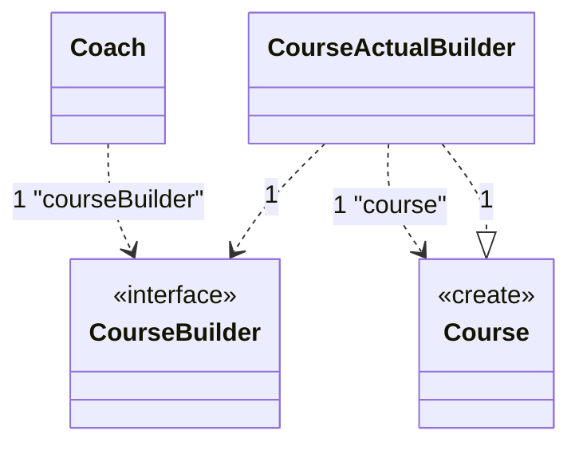

# 建造者模式（Builder Pattern，又名生成器模式）

## 1 基本概念

### 1.0 为啥要生成器模式?

一些复杂对象，拥有多个组成部分，如汽车包括车轮、方向盘、发送机等各部件。而大多用户无需知道这些部件装配细节，也几乎不会使用单独某部件，而是用一辆完整汽车！

这时就可通过建造者模式，将部件和其组装过程分开，一步一步创建一个复杂对象。用户只需指定复杂对象的类型就可得到该对象，而无需知其内部构造细节。

软件开发存在大量类似汽车的复杂对象，拥有一系列属性，这些复杂对象还可能存在一些限制条件，如：

- 某些属性没有赋值，则复杂对象不能作为一个完整产品使用
- 有些属性的赋值须按顺序，一个属性没赋值前，另一个属性可能无法赋值

复杂对象如一辆有待建造的汽车，对象的属性如汽车部件，建造产品过程就如组合部件过程。组合部件过程很复杂，因此，这些部件的组合过程往往被“外部化”到一个称作建造者的对象，建造者返还给客户端的是一个建造完毕的完整产品对象，而用户不关心该对象所包含的属性及它们组装方式。

### 1.1 定义

Builder Pattern是一种设计模式，创建型，又名：建造模式、Builder模式或构建者模式，是一种对象构建模式。它可将复杂对象的建造过程抽象出来（抽象类别），使这个抽象过程的不同实现方法可以构造出不同表现（属性）的对象。

### 1.2 简单理解

将一个复杂对象的构建与它的表示分离，使同样构建过程，可创建不同的表示。

用户只需指定需要建造的类型就可以得到它们，建造过程及细节不需要知道。

### 1.3 通用流程

先创建一个初始对象，然后逐渐添加新东西，最后调用 `build()` 方法完成构建。

## 2 适用场景

- 当创建复杂对象的算法应该独立于该对象的组成部分及它们的装配方式
- 当构造过程必须允许被构造的对象有不同的表示
- 一个对象有非常复杂的内部结构（很多属性）
- 想把复杂对象的创建和使用分离

## 3 优点

- 封装性好，创建和使用分离
- 扩展性好、建造类之间独立、一定程度上解耦

## 4 缺点

- 产生多余的Builder对象
- 产品内部发生变化，建造者都要修改，成本较大，所以需精心设计

## 5 v.s 其他设计模式

### 5.1 v.s 工厂模式

#### 工厂模式特点

- 注重方法调用顺序
- 创建复杂的作品，有各种复杂的部件组成
- 不止要创建出来，还要知道产品有哪些部件组成

### 生成器特点

- 注重创建产品，不关心顺序
- 创建出来的都一个样
- 只要创建出来对象即可

## 6 实战

课程类：

```java
public class Course {

    /**
     * 课程名称
     */
    private String courseName;

    /**
     * 课程PPT
     */
    private String coursePPT;

    /**
     * 课程视频
     */
    private String courseVideo;

    /**
     * 课程文档
     */
    private String courseArticle;

    /**
     * 课程QA
     */
    private String courseQA;
}
```

课程建造者：

```java
public abstract class CourseBuilder {

    public abstract void buildCourseName(String courseName);

    public abstract void buildCoursePPT(String coursePPT);

    public abstract void buildCourseVideo(String courseVideo);

    public abstract void buildCourseArticle(String courseArticle);

    public abstract void buildCourseQA(String courseQA);

    public abstract Course makeCourse();
}
```

课程真正建造：

```java
public class CourseActualBuilder extends CourseBuilder {

    private Course course = new Course();

    @Override
    public void buildCourseName(String courseName) {
        course.setCourseName(courseName);
    }

    @Override
    public void buildCoursePPT(String coursePPT) {
        course.setCoursePPT(coursePPT);
    }

    @Override
    public void buildCourseVideo(String courseVideo) {
        course.setCourseVideo(courseVideo);
    }

    @Override
    public void buildCourseArticle(String courseArticle) {
        course.setCourseArticle(courseArticle);
    }

    @Override
    public void buildCourseQA(String courseQA) {
        course.setCourseQA(courseQA);
    }

    @Override
    public Course makeCourse() {
        return course;
    }
}
```

课程教练：

```java
public class Coach {

    private CourseBuilder courseBuilder;

    public void setCourseBuilder(CourseBuilder courseBuilder) {
        this.courseBuilder = courseBuilder;
    }

    public Course makeCourse(String courseName, String coursePPT,
                             String courseVideo, String courseArticle,
                             String courseQA) {
        this.courseBuilder.buildCourseName(courseName);
        this.courseBuilder.buildCourseArticle(courseArticle);
        this.courseBuilder.buildCoursePPT(coursePPT);
        this.courseBuilder.buildCourseQA(courseQA);
        this.courseBuilder.buildCourseVideo(courseVideo);
        return this.courseBuilder.makeCourse();
    }
}
```




测试类：

```java
public class Test {
    public static void main(String[] args) {

        CourseBuilder courseBuilder = new CourseActualBuilder();
        Coach coach = new Coach();
        coach.setCourseBuilder(courseBuilder);

        Course course = coach.makeCourse("Java 设计模式",
                "Java 设计模式PPT",
                "Java 设计模式视频",
                "Java 设计模式博客",
                "Java 设计模式解疑");
        System.out.println(course);
    }
}
```

## 7  开源框架实例

### 7.1 StringBuilder

都是返回一个自身实例：


```java
@Override
@IntrinsicCandidate
public StringBuilder append(String str) {
    super.append(str);
    return this;
}
```

### 7.2  Guava不可变集合类


#### 建造者内部类

```java
public abstract class ImmutableSet<E> extends ImmutableCollection<E> implements Set<E> {
    public static class Builder<E> extends ImmutableCollection.Builder<E> { ... }
}
```

用于创建 ImmutableSet 实例的构建器。示例：

```java
static final ImmutableSet<Color> GOOGLE_COLORS =
    ImmutableSet.<Color>builder()
        .addAll(WEBSAFE_COLORS)
        .add(new Color(0, 191, 255))
        .build();
```

元素在结果集中出现的顺序与它们首次添加到构建器的顺序相同。建造不会改变建造者的状态，因此仍然可以添加更多元素并再次建造。

和之前同理，必存在一个 build 方法：


### 7.3 Mybatis的SqlSessionFactoryBuilder

入参为一个配置，传给默认的 session 工厂进行构造：

```java
public class SqlSessionFactoryBuilder {
  
  public SqlSessionFactory build(Configuration config) {
    return new DefaultSqlSessionFactory(config);
  }
```

解析MyBatis的xml文件：

```java
public class SqlSessionFactoryBuilder {
    public SqlSessionFactory build(Reader reader, String environment, Properties properties) {
        try {
            XMLConfigBuilder parser = new XMLConfigBuilder(reader, environment, properties);
            return build(parser.parse());
        } catch (Exception e) {
            throw ExceptionFactory.wrapException("Error building SqlSession.", e);
        } finally {
            ErrorContext.instance().reset();
            try {
                if (reader != null) {
                    reader.close();
                }
            } catch (IOException e) {
                // Intentionally ignore. Prefer previous error.
            }
        }
    }
}
```

```java
public class XMLConfigBuilder extends BaseBuilder {

    public Configuration parse() {
        if (parsed) {
            throw new BuilderException("Each XMLConfigBuilder can only be used once.");
        }
        parsed = true;
        parseConfiguration(parser.evalNode("/configuration"));
        return configuration;
    }
}
```

```java
public class XMLConfigBuilder extends BaseBuilder {

    private void parseConfiguration(XNode root) {
        try {
            // issue #117 read properties first
            propertiesElement(root.evalNode("properties"));
            Properties settings = settingsAsProperties(root.evalNode("settings"));
            loadCustomVfs(settings);
            loadCustomLogImpl(settings);

            typeAliasesElement(root.evalNode("typeAliases"));
            pluginElement(root.evalNode("plugins"));
            objectFactoryElement(root.evalNode("objectFactory"));
            objectWrapperFactoryElement(root.evalNode("objectWrapperFactory"));
            reflectorFactoryElement(root.evalNode("reflectorFactory"));
            settingsElement(settings);

            // read it after objectFactory and objectWrapperFactory issue #631
            environmentsElement(root.evalNode("environments"));
            databaseIdProviderElement(root.evalNode("databaseIdProvider"));
            typeHandlerElement(root.evalNode("typeHandlers"));
            mapperElement(root.evalNode("mappers"));
        } catch (Exception e) {
            throw new BuilderException("Error parsing SQL Mapper Configuration. Cause: " + e, e);
        }
    }
}
```

## 8 项目实战

```java
/**
 * Builder 模式抽象接口
 */
public interface Builder<T> extends Serializable {
    
    /**
     * 构建方法
     *
     * @return 构建后的对象
     */
    T build();
}
```

```java
/**
 * 线程池ThreadPoolExecutor构建器, 构建者模式
 */
public final class ThreadPoolBuilder implements Builder<ThreadPoolExecutor> {
    
    private int corePoolSize = calculateCoreNum();
    
    private int maximumPoolSize = corePoolSize + (corePoolSize >> 1);
    
    private long keepAliveTime = 30000L;
    
    private TimeUnit timeUnit = TimeUnit.MILLISECONDS;
    
    private BlockingQueue workQueue = new LinkedBlockingQueue(4096);
    
    private RejectedExecutionHandler rejectedExecutionHandler = new ThreadPoolExecutor.AbortPolicy();
    
    private boolean isDaemon = false;
    
    private String threadNamePrefix;
    
    private ThreadFactory threadFactory;
    
    private Integer calculateCoreNum() {
        int cpuCoreNum = Runtime.getRuntime().availableProcessors();
        return new BigDecimal(cpuCoreNum).divide(new BigDecimal("0.2")).intValue();
    }
    
    public ThreadPoolBuilder threadFactory(ThreadFactory threadFactory) {
        this.threadFactory = threadFactory;
        return this;
    }
    
    public ThreadPoolBuilder corePoolSize(int corePoolSize) {
        this.corePoolSize = corePoolSize;
        return this;
    }
    
    @Override
    public ThreadPoolExecutor build() {
        if (threadFactory == null) {
            Assert.notEmpty(threadNamePrefix, "The thread name prefix cannot be empty or an empty string.");
            threadFactory = ThreadFactoryBuilder.builder().prefix(threadNamePrefix).daemon(isDaemon).build();
        }
        ThreadPoolExecutor executorService;
        try {
            executorService = new ThreadPoolExecutor(corePoolSize,
                    maximumPoolSize,
                    keepAliveTime,
                    timeUnit,
                    workQueue,
                    threadFactory,
                    rejectedExecutionHandler);
        } catch (IllegalArgumentException ex) {
            throw new IllegalArgumentException("Error creating thread pool parameter.", ex);
        }
        return executorService;
    }
}
```

### 1.1 链式调用

Builder模式允许通过链式调用的方式逐步构建复杂对象，提高代码可读性和易用性。如构建线程池时，可清晰一步步指定各参数，而不需要记住参数的顺序或是创建多个构造函数。

```java
ThreadPoolExecutor executor = ThreadPoolBuilder.builder()
    .corePoolSize(10)
    .maximumPoolSize(20)
    .keepAliveTime(30000L, TimeUnit.MILLISECONDS)
    .workQueue(new LinkedBlockingQueue<>(4096))
    .threadFactory("myThreadPrefix", true)
    .rejected(new ThreadPoolExecutor.AbortPolicy())
    .build();
```

### 1.2 灵活性

通过Builder模式，可灵活地添加或修改构建过程中的步骤，而不影响已有的客户端代码。适合项目发展过程中需扩展或修改对象创建逻辑时。

### 参数校验

构建对象之前，可在Builder内部进行参数的校验，确保对象的状态是有效的。有助避免创建不合法的对象实例。

### 业务角度

1. **统一标准**：在整个项目中使用Builder模式作为创建复杂对象的标准方法，可以统一开发团队的编码风格，降低学习成本，提高代码的一致性。

2. **易于维护**：当业务需求变更导致对象的创建逻辑需要调整时，只需修改Builder类，而不需要修改大量调用处的代码。这使得维护和更新变得更加容易。

3. **适应性强**：随着业务的发展，可能需要创建的对象越来越复杂，Builder模式可以很好地适应这种变化。通过逐步构建的方式，即使是非常复杂的对象，也可以通过清晰的步骤来创建，而不会使代码变得难以理解和维护。

### v.s Lombok的@Builder

确实提供快速、简洁方式实现Builder模式，它自动为你的类生成一个静态的内部Builder类，通过链式方法调用来设置对象的状态，最后通过`build()`方法构建不可变对象。这种方式减少了大量的模板代码，使得实现Builder模式变得非常简单。

但直接用Lombok的@Builder也有局限性和考虑因素：

1. **定制性**：需高度定制Builder行为的场景，Lombok可能无法提供足够的灵活性。如需在构建对象之前进行复杂的校验，或者需要基于某些条件动态地改变对象的构建过程，使用Lombok力不从心。

2. **依赖性**：Lombok是一个编译时注解处理工具，它在项目中引入了额外的依赖。对于一些对依赖极其敏感的项目，可能会考虑避免使用Lombok，以减少外部依赖

3. **可读性和工具支持**：虽然Lombok减少了需要编写的代码量，但它也隐藏了很多细节。对于不熟悉Lombok的开发者来说，理解通过`@Builder`注解自动生成的代码可能需要一定的学习成本。此外，并不是所有的IDE或工具都能完美支持Lombok，需额外配置

4. **序列化和反序列化**：用Lombok的`@Builder`构建的对象进行序列化和反序列化时，可能会遇到一些问题，特别用某些库如Jackson进行JSON序列化/反序列化，可能需额外配置来确保正确处理。Jackson 在反序列化对象时需要一个默认的无参构造函数来实例化对象。然而，当你使用 `@Builder` 注解时，默认情况下不会生成这个无参构造函数。为了解决这个问题，你可以添加 Lombok 的 `@NoArgsConstructor` 或 `@AllArgsConstructor` 注解来确保存在适当的构造函数。

Lombok @Builder提供方便和快捷的方式来实现Builder模式，适合大多简单到中等复杂度场景。但需高度定制化或有特殊要求场景，手动实现Builder模式可能更好。