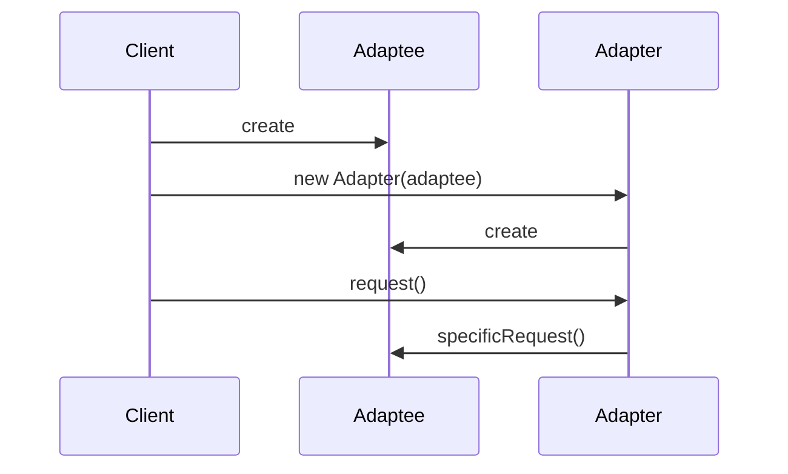
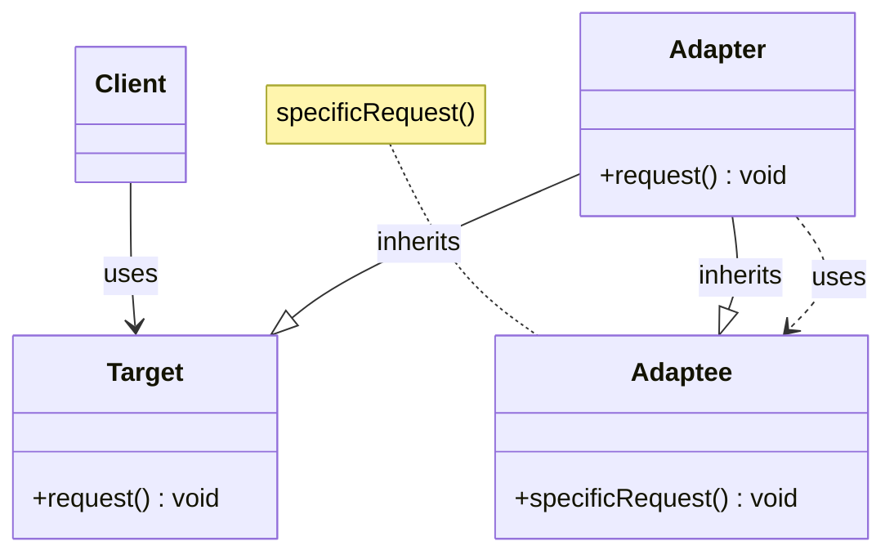
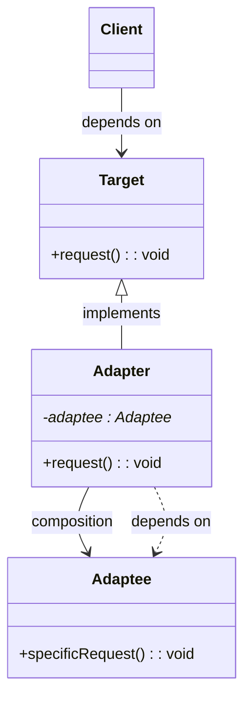
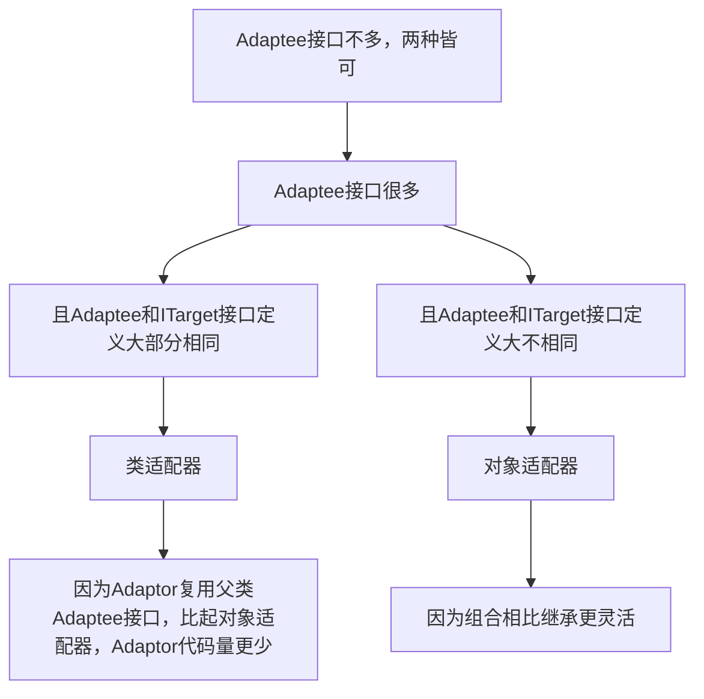
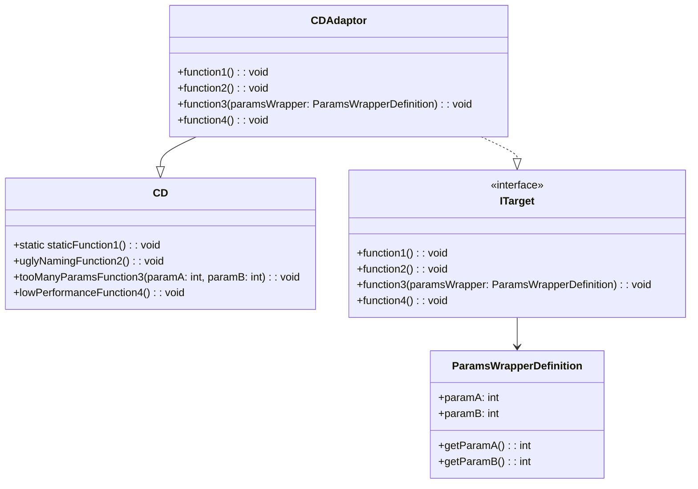
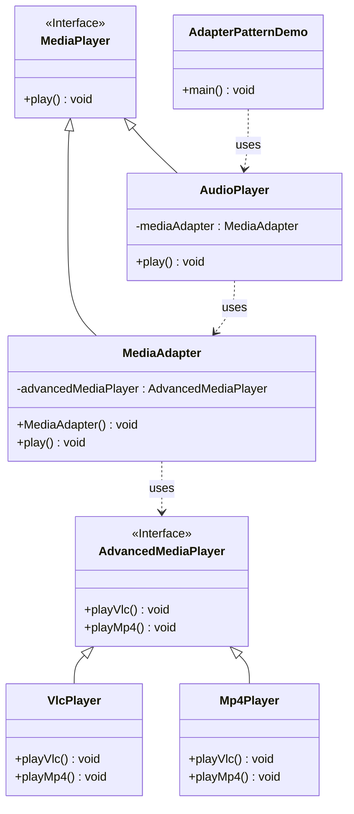

# 适配器模式

## 1 简介

一般客户端通过目标类的接口访问它所提供的服务。

有时，现有类可满足客户端类的需要，但所提供接口不一定是客户端所期望，可能因现有类中方法名与目标类中定义的方法名不一致。

这时，**现有接口需转化为客户端的期望接口，以复用现有类**。若不这样转化，客户端就不能利用现有类所提供功能，而适配器模式即可完成这样转化。

Sun在1996年公开Java语言的数据库连接工具JDBC，JDBC使Java能与数据库连接，并用SQL操作数据。JDBC给出一个客户端通用的抽象接口，每个具体数据库引擎（如SQL Server、Oracle、MySQL等）的JDBC驱动软件都是一个介于JDBC接口和数据库引擎接口之间的适配器软件。抽象的JDBC接口和各数据库引擎API之间都需要相应适配器软件，这就是为各不同数据库引擎准备的驱动程序。

### 1.1 定义

Adapter Design Pattern，将一个接口转换成客户端希望的另一个接口，使接口不兼容的那些类可以一起工作，其别名为包装器。
既可以作为类结构型模式，也可以作为对象结构型模式。

就是用来做适配，将不兼容的接口转为可兼容，让原本由于接口不兼容而不能协作的类能协作。如各种手机线转接头充当适配器，把两种不兼容接口，通过转接便可协作。

### 1.2 角色

*   Target：目标抽象类
*   Adapter：适配器类
*   Adaptee：适配者类
*   Client：客户类

## 2 实现方式

适配器模式中可定义一个包装类，包装不兼容接口的对象：

- 包装类：适配器(Adapter)
- 所包装的对象：适配者（Adaptee），即被适配的类

适配器提供客户类需要的接口。
适配器的实现，就是把客户端请求转化为对适配者的相应接口的调用。即当客户类调用适配器方法时，在适配器类的内部将调用适配者类的方法，而该过程对客户类透明，客户类并不直接访问适配者类。

因此，适配器可以使由于接口不兼容而不能交互的类可以一起协作。




### 2.1 类适配器（继承）





```java
// 要转化成的接口定义
public interface ITarget {
  void f1();
  void f2();
  void fc();
}

// 一组不兼容ITarget接口定义的接口
public class Adaptee {
  public void fa() { //... }
  public void fb() { //... }
  public void fc() { //... }
}

// 将Adaptee转化成一组符合ITarget接口定义的接口 
public class Adaptor extends Adaptee implements ITarget {
  public void f1() {
    super.fa();
  }
  
  public void f2() {
    //...重新实现f2()...
  }
  
  // 这里fc()不需要实现，直接继承自Adaptee，这是跟对象适配器最大的不同点
}
```

### 2.2 对象适配器（组合）




```java
// 对象适配器：基于组合
public interface ITarget {
  void f1();
  void f2();
  void fc();
}

public class Adaptee {
  public void fa() { //... }
  public void fb() { //... }
  public void fc() { //... }
}

public class Adaptor implements ITarget {
  private Adaptee adaptee;
  
  public Adaptor(Adaptee adaptee) {
    this.adaptee = adaptee;
  }
  
  public void f1() {
    adaptee.fa(); //委托给Adaptee
  }
  
  public void f2() {
    //...重新实现f2()...
  }
  
  public void fc() {
    adaptee.fc();
  }
}
```

### 2.3 选型





## 3 适用场景

适配器模式可看作一种“补偿模式”，补救设计缺陷。应用这种模式算是“无奈之举”。设计初期就规避接口不兼容问题的话，那这种模式就无需存在了。

适配器模式的应用场景是“接口不兼容”，问题是何时接口会不兼容？

### 3.1 封装缺陷接口

假设依赖的外部系统接口设计有缺陷（如含大量static方法），引入后影响自身代码可测试性。为隔离设计缺陷，对外部系统提供的接口进行二次封装。




```java
// 来自外部SDK，无权修改代码
public class CD {
}

// 适配器模式重构
public interface ITarget {
}

// 适配器类的命名不一定非带Adaptor
public class CDAdaptor extends CD implements ITarget {
  //...
  public void function1() {
     super.staticFunction1();
  }
  
  public void function2() {
    super.uglyNamingFucntion2();
  }
  
  public void function3(ParamsWrapperDefinition paramsWrapper) {
     super.tooManyParamsFunction3(paramsWrapper.getParamA(), ...);
  }
  
  public void function4() {
    //...reimplement it...
  }
}
```

### 3.2 统一多个类的接口设计

某功能实现依赖多个外部系统（或类）。通过该模式，将它们的接口适配为统一接口定义，就能多态复用。

如系统要对用户输入文本内容做敏感词过滤，为提高过滤的召回率，引入第三方敏感词过滤系统，依次对用户输入内容过滤。但每个系统提供的过滤接口都不同，即无法使用统一逻辑调用各系统。

适配器模式，将所有系统的接口适配为统一接口定义：

```java
// A敏感词过滤系统提供的接口
public class ASensitiveWordsFilter {
  // text是原始文本，函数输出用***替换敏感词之后的文本
  public String filterSexyWords(String text) {
    // ...
  }
  
  public String filterPoliticalWords(String text) {
    // ...
  } 
}

// B敏感词过滤系统提供的接口
public class BSensitiveWordsFilter  {
  public String filter(String text) {
    //...
  }
}

// C敏感词过滤系统提供的接口
public class CSensitiveWordsFilter {
  public String filter(String text, String mask) {
    //...
  }
}

// 未使用适配器模式前的代码：代码的可测试性、扩展性不好
public class RiskManagement {
  private ASensitiveWordsFilter aFilter = new ASensitiveWordsFilter();
  private BSensitiveWordsFilter bFilter = new BSensitiveWordsFilter();
  private CSensitiveWordsFilter cFilter = new CSensitiveWordsFilter();
  
  public String filterSensitiveWords(String text) {
    String maskedText = aFilter.filterSexyWords(text);
    maskedText = aFilter.filterPoliticalWords(maskedText);
    maskedText = bFilter.filter(maskedText);
    maskedText = cFilter.filter(maskedText, "***");
    return maskedText;
  }
}

// 使用适配器模式进行改造
public interface ISensitiveWordsFilter {
  // 统一接口定义
  String filter(String text);
}

public class ASensitiveWordsFilterAdaptor implements ISensitiveWordsFilter {
  
  private ASensitiveWordsFilter aFilter;
  
  public String filter(String text) {
    String maskedText = aFilter.filterSexyWords(text);
    maskedText = aFilter.filterPoliticalWords(maskedText);
    return maskedText;
  }
}

//...省略BSensitiveWordsFilterAdaptor、CSensitiveWordsFilterAdaptor...

// 扩展性更好，更符合OCP，若添加一个新的敏感词过滤系统，这个类完全不需要改动
// 基于接口而非实现编程，代码可测试性更好
public class RiskManagement { 
  private List<ISensitiveWordsFilter> filters = new ArrayList<>();
 
  public void addSensitiveWordsFilter(ISensitiveWordsFilter filter) {
    filters.add(filter);
  }
  
  public String filterSensitiveWords(String text) {
    String maskedText = text;
    for (ISensitiveWordsFilter filter : filters) {
      maskedText = filter.filter(maskedText);
    }
    return maskedText;
  }
}
```

### 3.3 替换依赖的外部系统

把项目中依赖的一个外部系统替换为另一个外部系统时。可减少对代码改动。

```java
// 外部系统A
public interface IA {
  //...
  void fa();
}
public class A implements IA {
  //...
  public void fa() { //... }
}
// 在我们的项目中，外部系统A的使用示例
public class Demo {
  private IA a;
  public Demo(IA a) {
    this.a = a;
  }
  //...
}
Demo d = new Demo(new A());

// 将外部系统A替换成外部系统B
public class BAdaptor implemnts IA {
  private B b;
  public BAdaptor(B b) {
    this.b= b;
  }
  public void fa() {
    //...
    b.fb();
  }
}
// 借助BAdaptor，Demo的代码中，调用IA接口的地方都无需改动，
// 只需要将BAdaptor如下注入到Demo即可。
Demo d = new Demo(new BAdaptor(new B()));
```

### 3.4 兼容老版本接口

版本升级时，对要废弃的接口，不直接将其删除，而是暂时保留，并@deprecated，并将内部实现逻辑委托给新接口实现。

好处：让使用它的项目有过渡期，而非强制进行代码修改。

JDK1.0中包含一个遍历集合容器的类Enumeration。JDK2.0对该类重构，改名为Iterator类，并对其代码优化。但考虑到若将Enumeration直接从JDK2.0删除，JDK1.0项目切换到JDK2.0代码就编译失败。须将项目中所有使用到Enumeration的地方，都修改为使用Iterator。

单独一个项目做Enumeration到Iterator的替换，还能接受。但Java开发项目太多，一次JDK升级，导致所有项目不做代码修改就编译报错，显然不合理，即不兼容升级。为做到兼容使用低版本JDK老代码，可暂时保留Enumeration类，并将其实现替换为直接调用Itertor。代码示例：

```java
public class Collections {
  public static Emueration emumeration(final Collection c) {
    return new Enumeration() {
      Iterator i = c.iterator();
      
      public boolean hasMoreElments() {
        return i.hashNext();
      }
      
      public Object nextElement() {
        return i.next():
      }
    }
  }
}
```

### 3.5 适配不同格式的数据

适配器模式主要用于接口适配，其实还可用在不同格式的数据之间的适配。如将从不同征信系统拉取的不同格式的征信数据，统一为相同格式，以方便存储和使用。

Arrays.asList()也可看作数据适配器，将数组类型的数据转化为集合容器类型。

```java
List<String> stooges = Arrays.asList("Larry", "Moe", "Curly");
```

## 4 Java日志设计

log4j、logback及JUL(java.util.logging)和Apache的JCL(Jakarta Commons Logging)，都提供相似功能，按级别（debug、info、warn、error……）打印日志，但未实现统一接口。

若项目中用到某组件使用log4j，而项目本身用logback。将组件引入后，项目就相当于有两套日志框架。每种日志框架都有自己特有配置方式。所以，要针对每种日志框架编写不同配置文件（如日志存储的文件地址、打印日志格式）。若引入多个组件，每个组件使用的日志框架都不一样，那日志本身的管理工作就变得非常复杂。为此，须统一日志打印框架。

Slf4j，类似JDBC规范，打印日志的统一接口规范。只定义接口，未提供实现，需配合具体日志框架（log4j、logback等）。Slf4j晚于JUL、JCL、log4j等日志框架，所以，这些日志框架也不可能牺牲版本兼容性，将接口改造成符合Slf4j接口规范。所以Slf4j不仅提供统一接口定义，还提供针对不同日志框架的适配器。对不同日志框架的接口进行二次封装，适配成统一接口定义。

### 4.1 slf4j统一接口定义


### 4.2 log4j日志框架的适配器

LocationAwareLogger继承自Logger接口，即Log4jLoggerAdapter实现Logger接口。

```java
package org.slf4j.impl;
public final class Log4jLoggerAdapter extends MarkerIgnoringBase
  implements LocationAwareLogger, Serializable {
  final transient org.apache.log4j.Logger logger; // log4j
 
  public void debug(String msg) {
    logger.log(FQCN, Level.DEBUG, msg, null);
  }
}
```

统一使用Slf4j提供的接口来编写打印日志的代码，而具体用啥日志框架实现（log4j、logback……），可动态指定（使用Java SPI），将相应SDK导入项目即可。

### 4.3 logback日志框架的适配器


```java
package ch.qos.logback.classic;

public final class Logger implements org.slf4j.Logger, LocationAwareLogger, AppenderAttachable<ILoggingEvent>, Serializable {
```

都是实现统一接口。

Q：若老项目无Slf4j，而直接用JCL，还想替换成其他日志框架如log4j，咋办？

A：Slf4j不仅提供从其他日志框架到Slf4j的适配器，还提供反向适配器，即从Slf4j到其他日志框架适配。于是，可先将JCL切换为Slf4j，再将Slf4j切换为log4j。经过两次适配器转换，就能将log4j切换为logback。

## 5 代理 V.S 桥接 V.S 装饰器 V.S 适配器模式

都可称Wrapper模式，即通过Wrapper类二次封装原始类。代码结构相似，但要解决的问题、应用场景不同。

代理模式：不改变原始类接口，为原始类定义一个代理类，主要为控制访问，而非加强功能，这是和装饰器模式的最大不同

桥接模式：接口和实现分离，让它们更易、也相对独立改变

装饰器模式：不改变原始类接口，对原始类功能进行增强，并支持多个装饰器的嵌套使用

适配器模式：一种事后补救策略。提供跟原始类不同的接口，而代理模式、装饰器模式都提供和原始类相同的接口

## 6 案例

### 需求描述


- 接口 *AdvancedMediaPlayer* 

想让 *AudioPlayer* 播放其他格式的音频文件。为此，需创建 

- 一个实现了 *MediaPlayer* 接口的适配器类 *MediaAdapter*

使用

-  *AdvancedMediaPlayer* 对象来播放所需的格式。

*AudioPlayer* 使用适配器类 *MediaAdapter* 传递所需的音频类型，不需要知道能播放所需格式音频的实际类。




### MediaPlayer接口

```java
package com.javaedge.design.pattern.structural.adapter.classadapter.v1;

/**
 * 媒体播放器
 *
 * @author JavaEdge
 * @date 2021/7/18
 */
public interface MediaPlayer {

    /**
     * 播放
     *
     * @param audioType 音频类型
     * @param fileName 文件名
     */
    void play(String audioType, String fileName);
}
```

```java
package com.javaedge.design.pattern.structural.adapter.classadapter.v1;

/**
 * 更高级的媒体播放器
 *
 * @author JavaEdge
 * @date 2021/7/18
 */
public interface AdvancedMediaPlayer {

    /**
     * 播放 Vlc
     *
     * @param fileName 文件名
     */
    void playVlc(String fileName);

    /**
     * 播放 Mp4
     *
     * @param fileName 文件名
     */
    void playMp4(String fileName);
}
```

### 实现类

实现了 *AdvancedMediaPlayer* 接口的实体类。该类可播放 vlc 和 mp4 格式的文件。

```java
package com.javaedge.design.pattern.structural.adapter.classadapter.v1;

/**
 * 实现了 AdvancedMediaPlayer 接口的实体类
 *
 * @author JavaEdge
 * @date 2021/7/18
 */
public class VlcPlayer implements AdvancedMediaPlayer {

    @Override
    public void playVlc(String fileName) {
        System.out.println("Playing vlc file. Name: " + fileName);
    }

    @Override
    public void playMp4(String fileName) {
        // do nothing
    }
}
```

```java
package com.javaedge.design.pattern.structural.adapter.classadapter.v1;

/**
 * 实现了 AdvancedMediaPlayer 接口的实体类
 *
 * @author JavaEdge
 * @date 2021/7/18
 */
public class Mp4Player implements AdvancedMediaPlayer{

    @Override
    public void playVlc(String fileName) {
        // do nothing
    }

    @Override
    public void playMp4(String fileName) {
        System.out.println("Playing mp4 file. Name: "+ fileName);
    }
}
```

### 实现 *MediaPlayer* 接口


```java
package com.javaedge.design.pattern.structural.adapter.classadapter.v1;

/**
 * 实现了 MediaPlayer 接口的适配器类
 *
 * @author JavaEdge
 * @date 2021/7/18
 */
public class MediaAdapter implements MediaPlayer {

    AdvancedMediaPlayer advancedMusicPlayer;

    public MediaAdapter(String audioType) {
        if ("vlc".equalsIgnoreCase(audioType)) {
            advancedMusicPlayer = new VlcPlayer();
        } else if ("mp4".equalsIgnoreCase(audioType)) {
            advancedMusicPlayer = new Mp4Player();
        }
    }

    @Override
    public void play(String audioType, String fileName) {
        if ("vlc".equalsIgnoreCase(audioType)) {
            advancedMusicPlayer.playVlc(fileName);
        } else if ("mp4".equalsIgnoreCase(audioType)) {
            advancedMusicPlayer.playMp4(fileName);
        }
    }
}
```

AudioPlayer默认可播放 mp3：

```java
package com.javaedge.design.pattern.structural.adapter.classadapter.v1;

/**
 * 实现 MediaPlayer 接口的实体类
 *
 * @author JavaEdge
 * @date 2021/7/18
 */
public class AudioPlayer implements MediaPlayer {

    MediaAdapter mediaAdapter;

    @Override
    public void play(String audioType, String fileName) {

        // 播放 mp3 音乐文件的内置支持
        if ("mp3".equalsIgnoreCase(audioType)) {
            System.out.println("Playing mp3 file. Name: " + fileName);
        }
        // mediaAdapter 提供了播放其他文件格式的支持
        else if ("vlc".equalsIgnoreCase(audioType)
                || "mp4".equalsIgnoreCase(audioType)) {
            mediaAdapter = new MediaAdapter(audioType);
            mediaAdapter.play(audioType, fileName);
        } else {
            System.out.println("Invalid media. " + audioType + " format not supported");
        }
    }
}
```

### 测试类

使用 *AudioPlayer* 类来播放各种格式。

```java
package com.javaedge.design.pattern.structural.adapter.classadapter.v1;

/**
 * 使用 AudioPlayer 来播放不同类型的音频格式
 *
 * @author JavaEdge
 * @date 2021/7/18
 */
public class AdapterPatternDemo {

    public static void main(String[] args) {

        AudioPlayer audioPlayer = new AudioPlayer();

        audioPlayer.play("mp3", "beyond the horizon.mp3");
        audioPlayer.play("mp4", "alone.mp4");
        audioPlayer.play("vlc", "far far away.vlc");
        audioPlayer.play("avi", "mind me.avi");
    }
}
```

### 测试类输出

```bash
Playing mp3 file. Name: beyond the horizon.mp3
Playing mp4 file. Name: alone.mp4
Playing vlc file. Name: far far away.vlc
Invalid media. avi format not supported
```

## 7 实现 `Iterable` 的 `Fibnoacci` 生成器

重写这个类，实现 `Iterable` 接口？

- 不过你并不是总拥有源代码的控制权
- 并且，除非必须这么做，否则，也不愿意重写一个类

因此另一种选择，创建一个 适配器实现所需接口。选型继承：


在 *for-in* 语句中使用 `IterableFibonacci`，必须在构造函数中提供一个边界值，这样 `hasNext()` 才知道何时返回 **false**，结束循环。

## 8 分析评价

### 8.1 优点


- 解耦目标类和适配者类，通过引入一个适配器类来重用现有的适配者类，而无须修改原有代码
- 增加了类的透明性和复用性，将具体的实现封装在适配者类中，对于客户端类来说是透明的，而且提高了适配者的复用性
- 灵活性和扩展性都非常好，通过使用配置文件，可以很方便地更换适配器，也可以在不修改原有代码的基础上增加新的适配器类，完全符合“OCP”

类适配器模式还具有如下优点：
由于适配器类是适配者类的子类，因此可以在适配器类中置换一些适配者的方法，使得适配器的灵活性更强。

对象适配器模式还具有如下优点：
一个对象适配器可以把多个不同的适配者适配到同一个目标，也就是说，同一个适配器可以把适配者类和它的子类都适配到目标接口。

### 8.2 缺点


- 类适配器模式

  Java不支持多继承，一次最多只能适配一个适配者类，且目标抽象类只能为抽象类，不能为具体类，其使用有一定的局限性，不能将一个适配者类和它的子类都适配到目标接口

- 对象适配器模式

  与类适配器模式相比，要想置换适配者类的方法就很麻烦。若必须置换掉适配者类的一个或多个方法，就只好先做一个适配者类的子类，将适配者类的方法置换掉，然后再把适配者类的子类当做真正的适配者进行适配，实现过程较为复杂

## 9 适用场景

- 系统需要使用现有的类，而这些类的接口不符合系统的需要
- 想要建立一个可以重复使用的类，用于与一些彼此之间没有太大关联的一些类，包括一些可能在将来引进的类一起工作

### 扩展

认适配器模式(Default Adapter Pattern)或缺省适配器模式
当不需要全部实现接口提供的方法时，可先设计一个抽象类实现接口，并为该接口中每个方法提供一个默认实现（空方法），那么该抽象类的子类可有选择地覆盖父类的某些方法来实现需求，它适用于一个接口不想使用其所有的方法的情况。因此也称为单接口适配器模式。

## 10 总结

结构型模式：描述如何将类或者对象结合在一起形成更大的结构。
适配器模式将一个接口转换成希望的另一个接口，适配器模式使接口不兼容的那些类能协作，其别名为包装器。既能作为类结构型模式，也可以作为对象结构型模式。

适配器模式包含四个角色：

- 目标抽象类定义客户要用的特定领域的接口
- 适配器类可调用另一个接口，作为一个转换器，对适配者和抽象目标类进行适配，它是适配器模式的核心
- 适配者类是被适配的角色，它定义了一个已经存在的接口，这个接口需要适配
- 客户类中针对目标抽象类进行编程，调用在目标抽象类中定义的业务方法


在类适配器模式中，适配器类实现了目标抽象类接口并继承了适配者类，并在目标抽象类的实现方法中调用所继承的适配者类的方法；在对象适配器模式中，适配器类继承了目标抽象类并定义了一个适配者类的对象实例，在所继承的目标抽象类方法中调用适配者类的相应业务方法。

适配器模式的主要优点是将目标类和适配者类解耦，增加了类的透明性和复用性，同时系统的灵活性和扩展性都非常好，更换适配器或者增加新的适配器都非常方便，符合“OCP”；类适配器模式的缺点是适配器类在很多编程语言中不能同时适配多个适配者类，对象适配器模式的缺点是很难置换适配者类的方法。

适配器模式适用情况包括：系统需要使用现有的类，而这些类的接口不符合系统的需要；想要建立一个可以重复使用的类，用于与一些彼此之间没有太大关联的一些类一起工作。


适配器模式是用来做适配，它将不兼容的接口转换为可兼容的接口，让原本由于接口不兼容而不能一起工作的类可以一起工作。适配器模式有两种实现方式：类适配器和对象适配器。其中，类适配器使用继承关系来实现，对象适配器使用组合关系来实现。

一般来说，适配器模式可看作一种“补偿模式”，用来补救设计上的缺陷。应用这种模式算是“无奈之举”，如设计初期，就能协调规避接口不兼容问题，那这种模式就没有应用机会。接口不兼容场景：

- 封装有缺陷的接口设计
- 统一多个类的接口设计
- 替换依赖的外部系统
- 兼容老版本接口
- 适配不同格式的数据