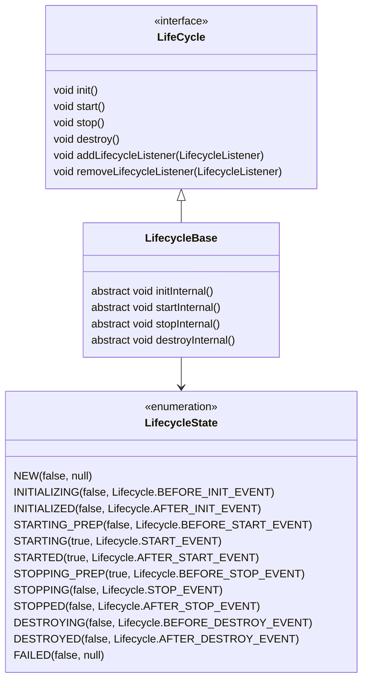

# 03-Tomcat的生命周期管理

## 1 Tomcat组件之间的静态关系


虚线表示一个请求在Tomcat中的流转。

想让一个系统能对外提供服务，需创建、组装并启动这些组件；服务停止时，要释放资源，这是个动态过程。即Tomcat需动态管理这些组件的生命周期。

设计一个较大系统或框架时，也要考虑：

- 咋统一管理组件的创建、初始化、启动、停止和销毁
- 咋做到代码逻辑清晰
- 咋方便添加或删除组件
- 咋做到组件启动和停止不遗漏、不重复

组件有大有小，大组件管理小组件，如Server管理Service，Service又管理连接器和容器；

组件有外有内，外层组件控制内层组件，如连接器是外层组件，负责对外交流，外层组件调用内层组件完成业务功能。即请求的处理过程由外层组件驱动。

这两层关系决定系统在创建组件时，应遵循顺序：

- 先创建子组件，再父组件，子组件要被“注入”父组件
- 先创建内组件，再外组件，内组件要被“注入”外组件

因此，最直观做法就是将图上所有组件按先小后大、先内后外顺序创建，再组装。这思路其实很有问题：

- 代码逻辑混乱、组件遗漏
- 不利于后期功能扩展

希望找到通用、统一方法来管理组件生命周期，就像汽车“一键启动”。

## 2  一键式启停：Lifecycle接口

设计，就是要找到系统变化点和不变点：

- 不变点
  每个组件都要经历创建、初始化、启动过程，这些状态及状态转化是不变的
- 变化点
  每个具体组件的初始化方法，即启动方法不同

把不变点抽象成接口，这接口跟生命周期有关，叫Lifecycle。Lifecycle接口应定义方法：init、start、stop和destroy，每个具体的组件去实现这些方法。

父组件init方法需创建子组件，并调用子组件init方法。同理父组件的start调用子组件的start，因此调用者可无差调用各组件的init、start，即组合模式，且只要调用最顶层组件，即Server组件的init和start方法，整个Tomcat就被启动了。

### 2.1 Lifecycle接口定义


### 2.2 可扩展性-Lifecycle事件

Host容器的启动方法需扫描webapps目录下的Web应用，创建相应Context容器，若以后新增逻辑，直接修改start方法？这违反OCP，咋解决这问题？

组件的init、start调用是由其父组件的状态变化触发，上层组件初始化触发子组件初始化，上层组件启动触发子组件启动，因此把：

- 组件生命周期定义成一个个状态
- 状态转变看作一个事件
- 而事件有监听器，在监听器里实现相关逻辑

于是，可在Lifecycle接口加方法：

- 添加监听器
- 删除监听器

还要定义一个Enum表示组件状态及处在啥状态会触发啥事件。因此Lifecycle接口和LifecycleState就定义成：

```uml
@startuml
interface LifeCycle {
  void init()
  void start()
  void stop()
  void destroy()
  void addLifecycleListener(LifecycleListener)
  void removeLifecycleListener(LifecycleListener)
}

enum LifecycleState {
  NEW(false, null),
  INITIALIZING(false, Lifecycle.BEFORE_INIT_EVENT),
  INITIALIZED(false, Lifecycle.AFTER_INIT_EVENT),
  STARTING_PREP(false, Lifecycle.BEFORE_START_EVENT),
  STARTING(true, Lifecycle.START_EVENT),
  STARTED(true, Lifecycle.AFTER_START_EVENT),
  STOPPING_PREP(true, Lifecycle.BEFORE_STOP_EVENT),
  STOPPING(false, Lifecycle.STOP_EVENT),
  STOPPED(false, Lifecycle.AFTER_STOP_EVENT),
  DESTROYING(false, Lifecycle.BEFORE_DESTROY_EVENT),
  DESTROYED(false, Lifecycle.AFTER_DESTROY_EVENT),
  FAILED(false, null)
}

LifeCycle -[dashed]-> LifecycleState
@enduml
```


组件到达相应的状态就触发相应的事件，如：

- NEW状态表示组件刚刚被实例化
- init方法被调用，状态变成INITIALIZING
- 这时，就触发BEFORE_INIT_EVENT事件，若有监听器在监听该事件，它的方法就会被调用

### 2.3 复用性-LifecycleBase抽象基类

不同类在实现接口往往有相同逻辑，定义基类实现共同逻辑，各子类去继承，以复用。

而基类中往往定义一些抽象方法，基类不会去实现这些方法，而是调用这些方法来实现骨架逻辑。留给子类实现，且子类须实现，否则无法实例化。

Tomcat定义一个基类LifecycleBase实现Lifecycle接口，把一些公共逻辑放到该基类，如：

- 生命状态的转变与维护
- 生命事件的触发
- 监听器的添加和删除

子类就负责实现自己的初始化、启动和停止等方法。为避免和基类中的方法同名，具体子类的实现方法改名，在加后缀Internal，叫initInternal、startInternal等：


引入基类LifecycleBase后的类图：




LifecycleBase定义抽象方法给具体子类实现，即模板设计模式。

### LifecycleBase#init

```java
@Override
public final synchronized void init() throws LifecycleException {
    // 1. 状态检查
    if (!state.equals(LifecycleState.NEW)) {
        invalidTransition(Lifecycle.BEFORE_INIT_EVENT);
    }

    try {
        // 2.触发INITIALIZING事件的监听器
        setStateInternal(LifecycleState.INITIALIZING, null, false);
        
        // 3.调用具体子类的初始化方法
        initInternal();
        
        // 4. 触发INITIALIZED事件的监听器
        setStateInternal(LifecycleState.INITIALIZED, null, false);
    } catch (Throwable t) {
      ...
    }
}
```

这个方法逻辑比较清楚，主要完成了四步：

- 检查状态的合法性，比如当前状态必须是NEW然后才能进行初始化
- 触发INITIALIZING事件的监听器：
  setStateInternal(LifecycleState.INITIALIZING, null, false);
  在这个setStateInternal方法里，会调用监听器的业务方法。
- 调用具体子类实现的抽象方法initInternal方法。我在前面提到过，为了实现一键式启动，具体组件在实现initInternal方法时，又会调用它的子组件的init方法
- 子组件初始化后，触发INITIALIZED事件的监听器，相应监听器的业务方法就会被调用
  setStateInternal(LifecycleState.INITIALIZED, null, false);

LifecycleBase负责触发事件，并调用监听器的方法，那是什么时候、谁把监听器注册进来的呢？分为两种情况：

- Tomcat自定义了一些监听器，这些监听器是父组件在创建子组件的过程中注册到子组件的。比如MemoryLeakTrackingListener监听器，用来检测Context容器中的内存泄漏，这个监听器是Host容器在创建Context容器时注册到Context中的
- 还可以在server.xml中定义自己的监听器，Tomcat在启动时会解析server.xml，创建监听器并注册到容器组件。

## 生周期管理总体类图

StandardServer、StandardService等是Server和Service组件的具体实现类，都继承自LifecycleBase：


StandardEngine、StandardHost、StandardContext和StandardWrapper是相应容器组件的具体实现类，因为它们都是容器，所以继承ContainerBase抽象基类，而ContainerBase实现Container接口，也继承LifecycleBase类，它们的生命周期管理接口和功能接口是分开的，这也符合**接口分离的原则**。

- 如需维护一堆有父子关系的实体，考虑组合模式
- 观察者模式：当一个事件发生后，需执行一连串更新操作。传统实现是在事件响应代码里直接加更新逻辑，当更新逻辑加多了，代码臃肿，且这种方式紧耦合、侵入式。而观察者模式实现低耦合、非侵入式的通知与更新机制
- 模板方法在抽象基类中经常用到，实现通用逻辑