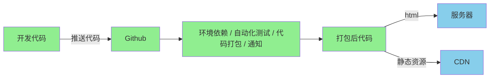

# 上线卡半夜、出 bug 只能硬扛？前端自动化部署 + 秒级回滚方案来了

## 0 前言

项目上线前最后一步，把开发好的代码部署到线上。

“npm run build不就行”。这只是在本地把代码打包，想在线上也可访问这些代码，还需部署。所以在下面，如今的前端代码部署时的难点在哪呢？

## 1 部署难点

### jQuery时代之前

前端项目中所有内容都是一些简单的静态资源。网站还没部署的概念，网站上线前，直接把开发完的项目打包发给运维，再由运维把代码直接上传到服务器的网站根目录下解压缩，完成项目部署。

### jQuery时代

项目的入口页面被后端管理，模板部署到后端，CSS、js和图片等静态资源依然是打包到后端之后，再解压处理。但现在，对前端的性能和稳定性的要求也越来越高，jQuery时代那种简单部署模式不足以应对性能优化、持续部署。

### 当下主要面临的代码部署难点

- 咋高效地利用项目中的文件缓存
- 咋能让整个项目的上线部署过程自动化，尽可能避免人力的介入，提高上线稳定性
- 项目上线之后，如果发现有重大Bug，要考虑咋尽快回滚代码

当我们面对这些代码部署上的难点，特别是在团队协作的项目中遇到时，我们就可以考虑对项目进行自动化部署了，这样代码部署的速度和稳定性会给项目研发效率带来很好的提升。

## 2 上线前的自动化部署

如下是大部分团队部署项目时的逻辑：


完成打包压缩，即开发完项目后，代码推送到GitHub，就算完成任务。但打包代码后，把代码上传服务器也是这步，对于前端开发者，很少能接触，但却很重要。

咋把打包好的代码上传服务器，需好的解决方案。

- 先需一台独立机器进行打包和构建，该机器需独立于所有开发环境，为保证打包环境稳定
- 部署任务启动的时候，需拉取远程代码，并切换到需部署的分支，然后锁定Node版本进行依赖安装、单元测试、ESLint等代码检查工作
- 最后，在这台机器，执行经过编译产出的打包后的代码，并打包上传代码到CDN和静态服务器
- 完成这些操作后，还要能通过脚本自动通过内部沟通软件通知团队项目构建的结果

项目部署过程可能遇到如下

### 问题

- 在什么os环境中执行项目的构建？
- 由谁触发构建？
- 咋管理前面所述的把代码上传CDN时，CDN账户的权限？
- 咋自动化执行部署的全过程，若每次都由人工执行，就得消耗一个人力守着编译打包，且易引发问题，如测试的步骤遗漏或部署顺序出错。咋提升构建速率，是部署功能中需解决的重要问题。

### 解决方案

如采用能保证环境一致性的Docker；自动化构建触发可通过GitHub Actions；GitHub的actions功能相当于给我们提供了一个免费的服务器，可以很方便地监控代码的推送、安装依赖、代码编译自动上传到服务器。



这是用GitHub Actions部署项目后的项目开发流程。现在静态资源管理已完成，也实现自动化部署。提交代码后，项目就可自动推送到服务器，网站第一次上线成功。

## 3 上线后的自动化部署

后续的持续上线咋办？直接发到生产环境，面临极大风险。但不直接发布到生产环境，我们就不能在本地和测试的前端环境去连接生产环境的数据库。

需预发布的（Pre）环境，只能让测试和开发访问，除了访问地址的环节不同，其他所有环节都和生产环境一致，提供最真实的回归测试环境。

又面临

### 3.1 问题

若确定下周一零点发布，就只能晚上12点准时守在电脑前等结果？若npm安装依赖失败或上线后发现重大Bug，就只能迎投诉？

随node\_modules体积越来越大，构建时间越来越长。若每次构建都需30min甚至更长，即使Bug在项目刚上线时就发现，且秒级响应修复，但重新部署项目时，也要等服务器慢慢编译。时间就是金钱，若你在修复Bug和重新部署项目上耗时长，就导致项目故障时间过长。

### 解决方案

需一种机制，让我们发现问题后，尽快回滚版本，且在回滚过程，尽可能无需人力介入。所以，需静态资源的版本管理，即让每个历史版本的资源都保留，且有唯一版本号，如故障，能瞬间切换版本。这个过程由具体代码实现后，只需点击回滚的版本号，系统就自动恢复到上线前版本。

该机制下，如业务流量特大，那直接全量上线的操作就会被禁止。为减少上线时，部署操作对用户的影响，需先选择一部分用户做灰度测试，即上线后的项目的访问权限，暂时只对这些用户开放。或做AB测试，如给北京的同学推送Vue课，给上海推荐React课等。我们要做的，是把不同版本代码分开打包，互不干涉。之后，再设计部署的机器和机房去适配不同用户。

Gtihub中可用actions配置打包功能，下面的代码是actions的配置文件。Ubuntu作服务器的打包环境，拉取GitHub最新master代码，并把Node版本固定14.7.6，执行npm install后，再执行npm run build代码打包压缩。

通过GitHub Actions自动化打包一份准备上线的代码：

```yaml
name: 打包应用的actions
on:
  push: # 监听代码时间
    branches:
      - master  # master分支代码推送的时候激活当前action
jobs:
  build:
    # runs-on 操作系统
    runs-on: ubuntu-latest
    steps:
      - name: 迁出代码
        uses: actions/checkout@master
      # 安装Node
      - name: 安装Node
        uses: actions/setup-node@v1
        with:
          node-version: 14.7.6
      # 安装依赖
      - name: 安装依赖
        run: npm install
      # 打包
      - name: 打包
        run: npm run build
```

然后配置上线服务器和GitHub Actions服务器的信任关系，通过SSH密钥可实现免登录直接部署。直接把build后的代码打包压缩，通过SSH直接上传到服务器，并且要进行代码文件版本的管理，就完成代码部署。

部署成功后的结果通知。钉钉、飞书都提供推送结果，可随时通过群机器人接口把消息推送到群内，把版本号、部署日期、发起人等信息推送到对应接口，就完成自动化部署。